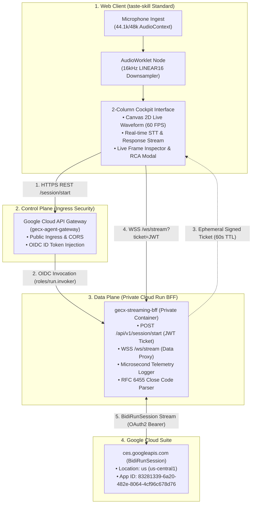

# GECX Real-Time Voice Streaming & Telemetry Console

[](https://python.org)
[](https://fastapi.tiangolo.com)
[](https://reactjs.org)
[](https://tailwindcss.com)
[](https://cloud.google.com)
[](https://ces.cloud.google.com)

> **Repository**: [https://github.com/Jhko0404/GECX-Real-Time-Voice-Streaming](https://github.com/Jhko0404/GECX-Real-Time-Voice-Streaming)  
> **Parent Documentation**: [System Design Document (docs/sdd.md)](file:///usr/local/google/home/junghyunko/git/2026-CX/02.gecx-streaming-api/docs/sdd.md) · [Technical Design Document (docs/tdd.md)](file:///usr/local/google/home/junghyunko/git/2026-CX/02.gecx-streaming-api/docs/tdd.md)

---

## 📌 Executive Overview (개요 및 목적)

본 프로젝트는 **Google Cloud CX Agent Studio (GECX, `ces.googleapis.com`)**의 실시간 양방향 스트리밍 API인 **`BidiRunSession`**을 활용한 **실시간 음성 AI(Audio-to-Audio) 콘솔 및 소켓 세션 단절 원인 분석(RCA) 진단 시스템**입니다.

### 🎯 핵심 해결 과제 (Key Problem Statement)
1. **서브세컨드(Sub-Second 0.3~0.5s) 저지연 음성 대화 실현**:
   * 기존 STT ➡️ LLM ➡️ TTS 3단계 직렬 구조의 지연(2~4초)을 극복하고, Gemini 기반 **Audio-to-Audio (A2A) Native Audio** 스트리밍 구현.
2. **80~120초 소켓 세션 단절 원인 실증 분석 (RCA Telemetry)**:
   * 현업 환경에서 관측된 80~120초 단절 현상에 대해 조기 방어(재연결) 대신 **RFC 6455 Close Code(1006 등) 및 밀리초 텔레메트리 로그를 수집하여 5대 가설(Server Timeout / Proxy Idle / Silence VAD 등)을 과학적으로 검증**.
3. **엔터프라이즈 제어/데이터 플레인 분리 & 비공개 보안 아키텍처**:
   * **Google Cloud API Gateway**를 통해 세션 발급(OIDC)을 수행하고, **비공개 Cloud Run BFF**와 단기 서명 티켓(JWT, 60s TTL)으로 WebSocket 직접 연결.

---

## 🏗️ End-to-End System Architecture




---

## 🚀 Key Features (주요 기능)

| 기능 (Feature) | 설명 (Description) |
| :--- | :--- |
| **2열 스플릿 콕핏 UI** | `Leonxlnx/taste-skill` 표준을 준수한 Linear 스타일의 고밀도 다크 테크 엔지니어링 콘솔. |
| **Canvas 2D 오실로스코프** | Web Audio API 기반 60 FPS 실시간 오디오 파형 (발화/무음/Barge-in 감응형 색상 전환). |
| **Always-On 오디오 청킹** | 50ms 고정 주기 (800 샘플, 1,600 바이트, 20Hz) 무중단 전송으로 백엔드 VAD 주변 노이즈 추적 지원. |
| **Instant Barge-In Flush** | 서버 `interruptionSignal` 수신 시 현재 재생 중인 에이전트 오디오 버퍼 즉시 중단. |
| **초정밀 프레임 인스펙터** | 실시간 WebSocket 패킷 스트림 테이블 (TX 오디오 청크 / RX STT / 시스템 이벤트 필터링). |
| **단절 RCA 진단 모달** | 80~120초 단절 발생 시 RFC 6455 Close Code 및 5대 가설 매핑 결과 표출, JSON 리포트 원클릭 다운로드. |
| **오프라인 Mock GECX** | GCP 연결 없이 로컬에서 90초/120초 단절 시뮬레이션 및 테스트 지원 (`tests/mock_gecx_server.py`). |

---

## 📁 Repository Directory Structure

```text
02.gecx-streaming-api/
├── docs/                         # 시스템 및 기술 설계 문서
│   ├── sdd.md                    # Solution Design Document (SDD)
│   ├── tdd.md                    # Technical Design Document (TDD)
│   ├── meeting_note.md           # 현업 요구사항 및 이슈 정의서
│   ├── BidiRunSession.md         # GECX 공식 API 레퍼런스 및 사양
│   └── ex_sdd.md                 # 엔터프라이즈 SDD 레퍼런스 템플릿
├── bff/                          # Cloud Run Backend-for-Frontend (Python FastAPI)
│   ├── main.py                   # FastAPI 엔트리포인트 (REST & WebSocket 프록시)
│   ├── config.py                 # GCP 프로젝트 및 환경 설정 로더
│   ├── auth.py                   # 세션 서명 토큰(JWT HS256) 발급/검증
│   ├── gecx_client.py            # GECX BidiRunSession WSS 스트리밍 클라이언트
│   └── telemetry.py              # 프레임 레벨 로깅, RMS 계산 & RCA 진단 모듈
├── web/                          # React Frontend (taste-skill Standard)
│   ├── package.json              # 프론트엔드 의존성
│   ├── vite.config.ts            # Vite 프록시 및 빌드 설정
│   ├── tailwind.config.ts        # Linear-style 테마 토큰
│   ├── index.html                # HTML 템플릿 (Geist Font)
│   └── src/
│       ├── App.tsx               # 2열 콕핏 메인 인터페이스
│       ├── audio/                # AudioWorklet PCM 16kHz & 재생 큐 매니저
│       ├── services/             # WebSocket 통신 서비스
│       └── components/           # UI 컴포넌트 (Visualizer, ChatWindow, FrameInspector 등)
├── api_gateway/                  # Google Cloud API Gateway 명세
│   ├── openapi_gateway.yaml      # x-google-backend가 정의된 Gateway 명세
│   └── gateway_config.json       # Gateway 배포 메타데이터
├── tests/                        # 단위 테스트 및 시뮬레이션
│   ├── mock_gecx_server.py       # 로컬 90s/120s 단절 시뮬레이션 Mock 서버
│   ├── test_audio.py             # DSP 오디오 변환 및 RMS 테스트
│   ├── test_auth.py              # JWT 인증 테스트
│   ├── test_telemetry.py         # 텔레메트리 로깅 테스트
│   └── test_mock_stream.py       # E2E Mock 스트리밍 통합 테스트
├── scripts/                      # 자동화 쉘 스크립트
│   ├── setup_env.sh              # Python 가상환경, gcloud 로그인, API 활성화
│   ├── run_local.sh              # 로컬 원클릭 실행 (BFF + React + Mock)
│   ├── deploy_cloudrun.sh        # Cloud Run 비공개 배포 및 IAM 설정
│   ├── deploy_gateway.sh         # Google Cloud API Gateway 배포
│   ├── stress_test_10m.py        # 10분 연속 스트리밍 부하/진단 테스트 러너
│   └── cleanup.sh                # PoC 리소스 안전 삭제
├── Dockerfile                    # Multi-stage Container 빌드 파일
├── requirements.txt              # Backend 패키지 의존성
├── .env.example                  # 환경변수 템플릿
├── CLAUDE.md                     # 프로젝트 개발 지침서
└── README.md                     # 본 문서
```

---

## ⚡ Quick Start & Customer Demo Guide

### 1. 사전 환경 초기화
```bash
# GCP 인증 점검, 필수 API 활성화 및 Python 가상환경 구성
./scripts/setup_env.sh
```

### 2. 로컬 원클릭 데모 실행 (Local Verification & Mock Demo)
```bash
# [모드 A] 로컬 90초 단절 시뮬레이션 Mock 모드로 실행 (RCA 모달 즉각 시연 가능)
./scripts/run_local.sh --mock 90

# [모드 B] 실제 GCP GECX(ces.googleapis.com) 연동 모드로 실행
./scripts/run_local.sh
```
* 웹 브라우저에서 **`http://localhost:8080`** 접속 후 **[CONNECT & START SESSION]** 클릭.
* 마이크로 한국어 음성 발화 ("오늘 서울 날씨 어때?") 테스트 진행.

### 3. Google Cloud 배포 (Cloud Run & API Gateway)
```bash
# 1단계: Cloud Run 비공개 배포 및 IAM 권한 자동 프로비저닝
./scripts/deploy_cloudrun.sh

# 2단계: API Gateway Ingress 배포
./scripts/deploy_gateway.sh
```

### 4. 10분 연속 스트리밍 부하/진단 테스트 (Automated RCA Runner)
```bash
# 10분간 50ms 오디오 청크를 연속 스트리밍하여 80~120초 단절 시점과 Close Code 정밀 측정
python3 scripts/stress_test_10m.py http://localhost:8080 600
```

### 5. PoC 리소스 안전 정리 (Teardown)
```bash
# PoC 종료 후 클라우드 과금 방지를 위한 원클릭 안전 삭제
./scripts/cleanup.sh
```

---

## 🔐 Predefined GCP Resources & Metadata

| Resource | Value | Description |
| :--- | :--- | :--- |
| **GCP Project ID** | `gemeni-workshop` | 대상 워크숍 프로젝트 |
| **Location / Region** | `us` / `us-central1` | GECX 리전 및 Cloud Run/Gateway 리전 |
| **CXAS App ID** | `83281339-6a20-482e-8064-4cf96c678d76` | CX Agent Studio 앱 리소스 |
| **Reference Gateway** | `https://coway-agent-gateway-7p7fk8nj.uc.gateway.dev/` | 레퍼런스 Agent Gateway |
| **CXAS Console** | [https://ces.cloud.google.com/...](https://ces.cloud.google.com/projects/gemeni-workshop/locations/us/apps/83281339-6a20-482e-8064-4cf96c678d76) | 콘솔 직접 접속 링크 |

---

## 📚 Technical Documentation Index

* [System Design Document (SDD)](docs/sdd.md) - 전체 아키텍처 다이어그램 및 엔드투엔드 시퀀스
* [Technical Design Document (TDD)](docs/tdd.md) - 마이크로초 텔레메트리 및 RCA 진단 알고리즘
* [Resource Map (전체 리소스 총괄 맵)](docs/resource_map.md) - 인프라, IAM, API, 데이터셋, 스크립트 단일 뷰
* [Troubleshooting & Resolution Guide](docs/troubleshooting.md) - 실환경 배포 및 연동 트러블슈팅 7대 항목
* [GECX BidiRunSession API Guide](docs/BidiRunSession.md) - 실시간 스트리밍 gRPC/WebSocket 프로토콜 명세
* [Project History & Timeline](HISTORY.md) - 단계별 개발 및 배포 이력

---

## 📄 License & Attribution
Designed and built for **Google Cloud Customer Experience (GECX) Real-Time Streaming Evaluation**.
