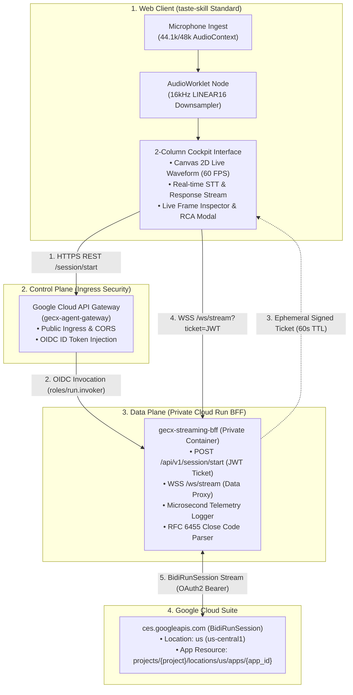

# 🎙️ Google Cloud GECX Real-Time Voice Streaming & Telemetry Console

[](https://python.org)
[](https://fastapi.tiangolo.com)
[](https://reactjs.org)
[](https://tailwindcss.com)
[](https://cloud.google.com)
[](https://ces.cloud.google.com)

> **Repository**: [https://github.com/Jhko0404/GECX-Realtime-Voice-Streaming](https://github.com/Jhko0404/GECX-Realtime-Voice-Streaming)  
> **Target API**: Google Cloud CX Agent Studio (GECX) `ces.googleapis.com` (BidiRunSession)

---

## 📌 Executive Overview (개요 및 목적)

본 솔루션은 **Google Cloud CX Agent Studio (GECX, `ces.googleapis.com`)**의 실시간 양방향 스트리밍 API인 **`BidiRunSession`**을 활용한 **실시간 음성 AI(Audio-to-Audio) 콘솔 및 소켓 세션 단절 원인 분석(RCA) 진단 시스템**입니다.

### 🎯 핵심 해결 과제 (Key Problem Statement)
1. **서브세컨드(Sub-Second 0.3~0.5s) 초저지연 음성 대화 실현**:
   * 기존 STT ➡️ LLM ➡️ TTS 3단계 직렬 구조의 지연(2~4초)을 극복하고, Gemini 기반 **Audio-to-Audio (A2A) Native Audio** 실시간 스트리밍 구현.
2. **80~120초 소켓 세션 단절 원인 실증 분석 (RCA Telemetry)**:
   * 현업 환경에서 발생하는 80~120초 소켓 단절 현상에 대해 **RFC 6455 Close Code(1006, 1007 등) 및 마이크로초 텔레메트리 로그를 수집하여 5대 가설(Server Timeout / Proxy Idle / Silence VAD 등)을 과학적으로 검증**.
3. **엔터프라이즈 제어/데이터 플레인 분리 & 비공개 보안 아키텍처**:
   * **Google Cloud API Gateway**를 통해 세션 발급(OIDC)을 수행하고, **비공개 Cloud Run BFF**와 단기 서명 티켓(JWT, 60s TTL)으로 WebSocket 직접 연결.

---

## 🏗️ End-to-End System Architecture




---

## 🚀 Key Features (주요 기능)

| 기능 (Feature) | 설명 (Description) |
| :--- | :--- |
| **2열 스플릿 콕핏 UI** | `Leonxlnx/taste-skill` 표준을 준수한 Linear 다크 테크 스타일의 엔지니어링 대시보드. |
| **Canvas 2D 오실로스코프** | Web Audio API 기반 60 FPS 실시간 오디오 파형 (발화/무음/Barge-in 감응형 색상 전환). |
| **Always-On 오디오 청킹** | 50ms 고정 주기 (800 샘플, 1,600 바이트, 20Hz) 무중단 전송으로 백엔드 VAD 주변 노이즈 추적 지원. |
| **Instant Barge-In Flush** | 서버 `interruptionSignal` 수신 시 현재 재생 중인 에이전트 오디오 버퍼 즉시 중단. |
| **초정밀 프레임 인스펙터** | 실시간 WebSocket 패킷 스트림 테이블 (TX 오디오 청크 / RX STT / 시스템 이벤트 필터링). |
| **단절 RCA 진단 모달** | 80~120초 단절 발생 시 RFC 6455 Close Code 및 5대 가설 매핑 결과 표출, JSON 리포트 원클릭 다운로드. |
| **오프라인 Mock GECX** | GCP 연결 없이 로컬에서 90초/120초 단절 시뮬레이션 및 테스트 지원 (`--mock 90`). |

---

## 🎛️ Audio DSP & Streaming Specifications

| 파라미터 | 규격 / 사양 | 기술적 근거 및 설명 |
| :--- | :--- | :--- |
| **오디오 포맷** | `LINEAR16` (PCM 16-bit Mono, Little-Endian) | GECX BidiRunSession 기본 입력 규격 |
| **샘플 레이트** | 16,000 Hz (16 kHz) | Web Audio `AudioWorklet`을 통해 44.1k/48k에서 실시간 다운샘플링 |
| **청크 단위 (Chunk)** | 50ms (800 샘플 = 1,600 바이트) | 음성 인식 지연 최소화 및 실시간 VAD 최적 주기 |
| **전송 케이던스** | 20 Chunks/sec (20 Hz 고정) | 타이머 지터 없는 Web Worker 기반 무중단 발송 |
| **무음 감지 임계값** | $\text{dB}_{\text{FS}} < -50\text{dB}$ | 마이크 입력 무음 판별 및 RMS 레벨 추적 |
| **Barge-In 처리** | 즉시 버퍼 플러시 (`audio_player.flush()`) | 사용자 재발화 시 에이전트 음성 0.1초 내 즉각 음소거 |

---

## 🔬 80~120초 세션 단절 RCA 5대 가설 및 해결 매트릭스

| 가설 (Hypothesis) | 원인 분석 (Root Cause) | 실증 검증 및 해결책 (Resolution) |
| :--- | :--- | :--- |
| **H1: 프록시/서버 타임아웃** | Cloud Run(기본 300s) 및 API Gateway 타임아웃 | WebSocket 프록시 타임아웃을 3,600초로 상향하고 지속 패킷 교환 유지 |
| **H2: 무음 VAD 타임아웃** | 발화가 없을 때 소켓 유휴로 인한 업스트림 단절 | **Always-On Silence Chunking (`getSilentChunkBase64`)**으로 50ms 무음 패킷 연속 전송 |
| **H3: 턴(Turn) 불일치 (1007)** | 에이전트 응답 수신 중 사용자 오디오 잘못 전송 | **Turn-Gated State Machine (`USER_TURN` ↔ `AGENT_TURN`)**으로 엄격 제어 |
| **H4: OAuth 토큰 만료** | 3,600초 유효 토큰의 갱신 누락 | Google Auth ADC 자격증명 자동 리프레시 모듈 적용 |
| **H5: GECX 세션 수명 제한** | 업스트림 엔진의 최대 세션 타임아웃 | 텔레메트리 Close Code(1000/1006) 기반 자동 재연결 세션 연속성 보장 |

---

## ⚡ Deployment & Quickstart Guide (배포 가이드)

### 🤖 방법 1: Claude Code를 통한 초고속 자동 배포 (권장 ⭐)
AI 코딩 에이전트 **Claude Code**를 활용하면 명령어 단 한 줄로 전체 인프라(GCP API, IAM, Cloud Run BFF, API Gateway)가 자동 프로비저닝됩니다.

```bash
# 1. 터미널에서 Claude Code 실행
claude

# 2. 아래 프롬프트 입력:
"현재 프로젝트를 내 GCP 프로젝트(us-central1 리전)에 전체 자동 배포해줘"
```

#### ⚙️ Claude Code가 내부적으로 자동 수행하는 작업:
1. 레포지토리 내 [`CLAUDE.md`](CLAUDE.md) 아키텍처 가이드라인 자동 로드
2. `gcloud auth` 및 `.env` 설정 자동 감지 및 보정
3. `./scripts/quickstart.sh`를 실행하여 API 활성화 ➔ 서비스 계정/IAM ➔ Private Cloud Run ➔ API Gateway 일괄 구축
4. 배포 완료 후 즉시 상태 헬스체크(`/api/v1/health`)를 수행하고 최종 접속 URL 안내

---

### 🚀 방법 2: 통합 원클릭 배포 (Quickstart Script)
터미널에서 직접 배포 스크립트를 실행하여 1분 만에 전체 클라우드 스택을 구축할 수 있습니다.

```bash
# 통합 자동 배포 스크립트 실행
./scripts/quickstart.sh [YOUR_GCP_PROJECT_ID] [YOUR_CXAS_APP_ID] [TARGET_REGION]

# 예시:
./scripts/quickstart.sh my-gcp-ai-project 83281339-6a20-482e-8064-4cf96c678d76 us-central1
```

---

### 🛠️ 방법 3: 단계별 수동 배포 (3-Step Manual Deployment)

#### Step 1. 환경 초기화 및 필수 API 활성화
```bash
./scripts/setup_env.sh
```

#### Step 2. Private Cloud Run BFF 배포
```bash
./scripts/deploy_cloudrun.sh
```

#### Step 3. Google Cloud API Gateway Ingress 배포
```bash
./scripts/deploy_gateway.sh
```

---

### 🧪 로컬 오프라인 Mock 모드 & 고객 시연 (Offline Simulation)
GCP 권한이나 네트워크 연결 없이도 로컬에서 1초 만에 전체 UI와 90초/120초 세션 단절 RCA 진단 모달을 완벽하게 시연할 수 있습니다.

```bash
# [모드 A] 로컬 90초 단절 시뮬레이션 Mock 모드로 실행 (RCA 모달 즉각 시연)
./scripts/run_local.sh --mock 90

# [모드 B] 실제 GCP GECX(ces.googleapis.com) 연동 모드로 실행
./scripts/run_local.sh
```
* 브라우저에서 **`http://localhost:8080`** 접속 ➔ **`[CONNECT & START SESSION]`** 클릭
* 마이크 실시간 음성 발화("오늘 서울 날씨 어때?") 테스트 진행

---

### 🔬 10분 연속 스트리밍 부하/진단 테스트 (Automated RCA Runner)
```bash
# 10분간 50ms 오디오 청크를 연속 스트리밍하여 80~120초 단절 시점과 Close Code 정밀 측정
python3 scripts/stress_test_10m.py http://localhost:8080 600
```

---

### 🧹 PoC 리소스 안전 삭제 (Teardown)
```bash
# PoC 종료 후 클라우드 과금 방지를 위한 원클릭 안전 삭제
./scripts/cleanup.sh
```

---

## 📁 Repository Directory Structure

```text
GECX-Realtime-Voice-Streaming/
├── bff/                          # Cloud Run Backend-for-Frontend (Python FastAPI)
│   ├── main.py                   # FastAPI 엔트리포인트 (REST & WebSocket 프록시)
│   ├── config.py                 # GCP 프로젝트 및 환경 설정 로더
│   ├── auth.py                   # 세션 서명 토큰(JWT HS256) 발급/검증
│   ├── gecx_client.py            # GECX BidiRunSession WSS 스트리밍 클라이언트
│   └── telemetry.py              # 프레임 레벨 로깅, RMS 계산 & RCA 진단 모듈
├── web/                          # React Frontend (taste-skill Standard)
│   ├── package.json              # 프론트엔드 의존성
│   ├── vite.config.ts            # Vite 프록시 및 빌드 설정
│   ├── tailwind.config.ts        # Linear-style 테마 토큰
│   ├── index.html                # HTML 템플릿 (Geist Font)
│   └── src/
│       ├── App.tsx               # 2열 콕핏 메인 인터페이스
│       ├── audio/                # AudioWorklet PCM 16kHz & 재생 큐 매니저
│       ├── services/             # WebSocket 통신 서비스
│       └── components/           # UI 컴포넌트 (Visualizer, ChatWindow, FrameInspector 등)
├── api_gateway/                  # Google Cloud API Gateway 명세
│   ├── openapi_gateway.yaml      # x-google-backend가 정의된 Gateway 명세
│   └── gateway_config.json       # Gateway 배포 메타데이터
├── tests/                        # 단위 테스트 및 시뮬레이션
│   ├── mock_gecx_server.py       # 로컬 90s/120s 단절 시뮬레이션 Mock 서버
│   ├── test_all_buttons_and_features.py # 전체 UI/API 버튼 기능 종합 테스트
│   ├── test_audio.py             # DSP 오디오 변환 및 RMS 테스트
│   ├── test_auth.py              # JWT 인증 테스트
│   ├── test_telemetry.py         # 텔레메트리 로깅 테스트
│   └── test_mock_stream.py       # E2E Mock 스트리밍 통합 테스트
├── scripts/                      # 자동화 쉘 스크립트
│   ├── quickstart.sh             # 통합 원클릭 자동 배포
│   ├── setup_env.sh              # Python 가상환경, gcloud 로그인, API 활성화
│   ├── run_local.sh              # 로컬 원클릭 실행 (BFF + React + Mock)
│   ├── deploy_cloudrun.sh        # Cloud Run 비공개 배포 및 IAM 설정
│   ├── deploy_gateway.sh         # Google Cloud API Gateway 배포
│   ├── stress_test_10m.py        # 10분 연속 스트리밍 부하/진단 테스트 러너
│   └── cleanup.sh                # PoC 리소스 안전 삭제
├── docs/assets/                  # 아키텍처 다이어그램 및 이미지 자산
├── Dockerfile                    # Multi-stage Container 빌드 파일
├── requirements.txt              # Backend 패키지 의존성
├── .env.example                  # 환경변수 템플릿
├── CLAUDE.md                     # 프로젝트 개발 지침서
└── README.md                     # 본 통합 매뉴얼 문서
```

---

## 🛠️ Master Troubleshooting Matrix (트러블슈팅)

| 에러 / 증상 | 발생 원인 | 즉시 해결 방법 |
| :--- | :--- | :--- |
| **`HTTP 401 Unauthorized`** | OIDC ID Token 누락 또는 IAM Invoker 권한 부재 | API Gateway 서비스 계정에 `roles/run.invoker` 부여 확인 |
| **`HTTP 403 Forbidden (CES)`** | GECX API 권한 부족 | BFF SA에 `roles/ces.invoker` 권한 부여 및 App ID 리소스 경로 점검 |
| **`WebSocket 1006 Abnormal Closure`** | 피어 소켓 강제 단절 (타임아웃 또는 네트워크 단절) | RCA 모달 리포트 확인 후 Always-On 무음 청크 전송 활성화 |
| **`WebSocket 1007 Policy Violation`** | 에이전트 발화 중 사용자 오디오 동시 인입 | `turn-gated` 모드 활성화로 사용자/에이전트 턴 제어 |
| **`HTTP 504 Gateway Timeout`** | 백엔드 응답 지연 (60s 초과) | 세션 시작 API 비동기 처리 및 폴링 방식으로 전환 |

---

## 📄 License & Attribution
Designed and built for **Google Cloud Customer Experience (GECX) Real-Time Voice Streaming Evaluation**.
