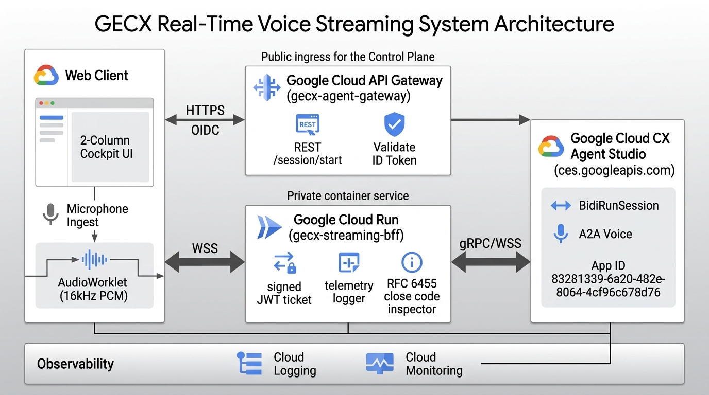
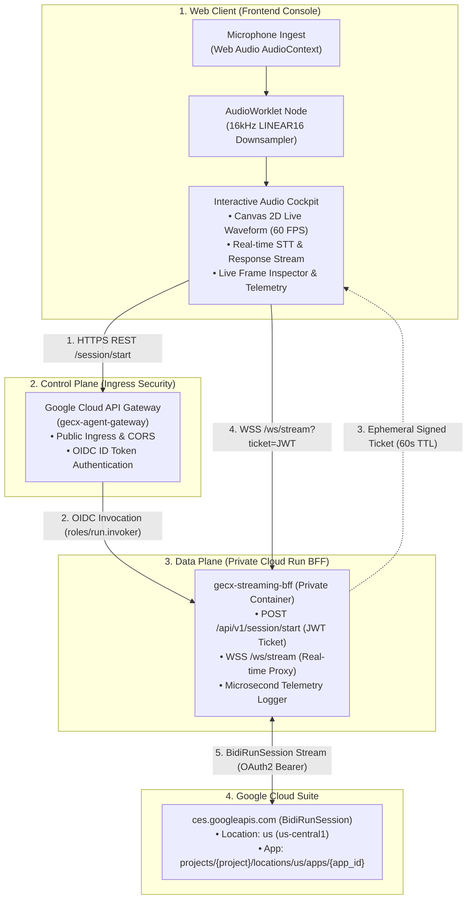

# GECX Real-Time Voice Streaming

[](https://python.org)
[](https://fastapi.tiangolo.com)
[](https://reactjs.org)
[](https://tailwindcss.com)
[](https://cloud.google.com)
[](https://ces.cloud.google.com)

> **Repository**: [https://github.com/Jhko0404/GECX-Realtime-Voice-Streaming](https://github.com/Jhko0404/GECX-Realtime-Voice-Streaming)  
> **Target Service**: Google Cloud CX Agent Studio (GECX) `ces.googleapis.com` (BidiRunSession)

---

## 1. Overview & Live Demo

본 프로젝트는 **Google Cloud CX Agent Studio (GECX)**의 실시간 양방향 음성 스트리밍 API인 **`BidiRunSession`**을 웹 브라우저에서 직접 체험하고 검증할 수 있는 **실시간 음성 AI(Audio-to-Audio) 인터랙티브 콘솔**입니다.

사용자의 마이크 입력을 실시간으로 캡처(PCM 16kHz)하여 Google Cloud Gemini Native Audio 엔진과 양방향 WebSocket으로 연결하고, 지연 없이 음성으로 대화하며 실시간 텍스트 전사(STT), 음성 파형(Waveform), 세션 통계를 한 화면에서 확인할 수 있습니다.

---

## 2. Quick Start: Clone and Run in 30 Seconds

### Step 0: Clone the Repository
```bash
git clone https://github.com/Jhko0404/GECX-Realtime-Voice-Streaming.git
cd GECX-Realtime-Voice-Streaming
```

---

### Option A: Local Mock Demo (GCP 계정 없이 30초 내 즉시 UI/오디오 시연)
GCP 프로젝트나 클라우드 권한이 없어도 로컬 모의(Mock) GECX 서버를 통해 전체 실시간 음성 스트리밍 콘솔과 오디오 시각화, Barge-in 동작을 바로 체험할 수 있습니다.

```bash
# 1. 가상환경 구성 및 의존성 자동 설치
./scripts/setup_env.sh

# 2. 로컬 모의(Mock) 스트리밍 서버 모드로 실행
./scripts/run_local.sh --mock 90
```
1. 웹 브라우저에서 `http://localhost:8080` 접속
2. **[CONNECT & START SESSION]** 버튼 클릭
3. 브라우저 마이크 권한 허용 후 한국어 음성 발화("오늘 날씨 어때?") 테스트 진행

---

### Option B: Live GECX Connected Mode (실제 GCP 환경 연동 로컬 실행)
```bash
# GCP Application Default Credentials(ADC) 로그인 후 실행
gcloud auth application-default login
./scripts/run_local.sh
```

---

## 3. Key Demo Features & Capabilities

### 1) 실시간 양방향 음성 대화 (Audio-to-Audio Native Streaming)
* 브라우저 마이크 음성을 Web Audio `AudioWorklet`을 통해 16kHz LINEAR16 PCM으로 실시간 변환하고, 50ms 단위 청크로 무중단 스트리밍합니다.
* AI의 음성 응답이 들어오는 즉시 오디오 큐(Queue)를 통해 끊김 없이 재생됩니다.

### 2) 60 FPS 실시간 오실로스코프 (Canvas 2D Waveform)
* 사용자 발화와 에이전트 음성 출력의 실시간 진폭/주파수 파형을 60 FPS 캔버스 그래픽으로 렌더링합니다.
* 사용자 발화, 에이전트 응답, 무음 대기 상태에 따라 동적으로 비주얼 테마가 전환됩니다.

### 3) 실시간 말 끊기 (Instant Barge-In)
* 에이전트가 음성으로 답변하는 도중 사용자가 다시 말을 시작하면, 에이전트 음성 출력을 즉각 음소거(Flush)하고 새로운 사용자 발화에 즉시 반응합니다.

### 4) 실시간 텍스트 전사 및 타자기 스트리밍 (Live STT & Progressive Text)
* 오디오 스트리밍과 동시에 사용자 발화 및 에이전트 응답 텍스트가 실시간 전사되어 대화창에 표출됩니다.

### 5) 실시간 프레임 인스펙터 & 텔레메트리 대시보드
* 전송 중인 50ms 오디오 패킷(TX), 수신된 텍스트/오디오 패킷(RX), 왕복 지연 시간(TTFT), 무음 지속 시간 통계를 실시간으로 모니터링할 수 있습니다.

---

## 4. System Architecture

클라이언트 브라우저와 Google Cloud 백엔드 간의 제어 플레인(인증/세션 발급)과 데이터 플레인(고속 WebSocket 스트리밍)이 안전하게 분리된 구조입니다.





---

## 5. Audio & Streaming Specifications

| 파라미터 | 규격 / 사양 | 기술적 설명 |
| :--- | :--- | :--- |
| **오디오 포맷** | `LINEAR16` (PCM 16-bit Mono, Little-Endian) | GECX BidiRunSession 기본 입력 규격 |
| **샘플 레이트** | 16,000 Hz (16 kHz) | Web Audio AudioWorklet으로 44.1k/48k에서 실시간 다운샘플링 |
| **청크 단위 (Chunk)** | 50ms (800 샘플 = 1,600 바이트) | 음성 인식 지연 최소화 및 실시간 VAD 최적 주기 |
| **전송 케이던스** | 20 Chunks/sec (20 Hz 고정) | 타이머 지터 없는 Web Worker 기반 무중단 발송 |
| **무음 감지 임계값** | $\text{dB}_{\text{FS}} < -50\text{dB}$ | 마이크 입력 무음 판별 및 RMS 레벨 추적 |
| **Barge-In 처리** | 즉시 버퍼 플러시 (`audio_player.flush()`) | 사용자 재발화 시 에이전트 음성 즉각 음소거 |

---

## 6. Google Cloud Production Deployment Guide

### 사전 준비사항 (Prerequisites)
1. **Google Cloud SDK (`gcloud`)** 설치 및 로그인 (`gcloud auth login`)
2. **Node.js (v18+)** 및 **Python (v3.11+)** 설치
3. GCP 프로젝트에 **Owner** 또는 **Editor** 권한 보유

---

### 배포 방법 1: Claude Code를 통한 전자동 배포 (가장 추천)
AI 코딩 에이전트 **Claude Code**를 활용하면 명령어 단 한 줄로 전체 인프라(GCP API, IAM, Cloud Run BFF, API Gateway)가 자동 프로비저닝됩니다.

```bash
# 1. 터미널에서 Claude Code 실행
claude

# 2. 아래 프롬프트 입력:
"내 GCP 프로젝트 ID (예: my-gcp-ai-project)와 리전(us-central1)에 GECX Voice Streaming 전체를 배포해줘"
```

---

### 배포 방법 2: 통합 원클릭 배포 스크립트 (CLI Quickstart)
스크립트 실행 한 번으로 GCP API 활성화, 서비스 계정 IAM 생성, Cloud Run 컨테이너 빌드, API Gateway 배포까지 1번에 완료됩니다.

```bash
# 사용법: ./scripts/quickstart.sh [GCP_PROJECT_ID] [CXAS_APP_ID] [TARGET_REGION]
./scripts/quickstart.sh my-gcp-ai-project 83281339-6a20-482e-8064-4cf96c678d76 us-central1
```

---

### 배포 방법 3: 단계별 수동 배포 (3-Step Manual Deployment)

#### Step 1. 환경 초기화 및 필수 API 활성화
```bash
# 가상환경 구성, gcloud 로그인 점검 및 필수 7개 GCP API 활성화
./scripts/setup_env.sh
```

#### Step 2. Private Cloud Run BFF 배포
```bash
# Multi-stage Docker 컨테이너 빌드 & 비공개 Cloud Run 배포 (IAM 권한 자동 바인딩)
./scripts/deploy_cloudrun.sh
```

#### Step 3. Google Cloud API Gateway Ingress 배포
```bash
# OpenAPI Spec 생성 및 Zero-Trust Gateway Ingress 라우팅 배포
./scripts/deploy_gateway.sh
```

---

### 🧪 배포 검증 및 부하 테스트 (Verification & Stress Test)
```bash
# 1. 단위 및 통합 테스트 12종 전체 검증
.venv/bin/pytest -v

# 2. 10분 연속 스트리밍 부하/진단 테스트 (세션 안정성 및 Close Code 측정)
python3 scripts/stress_test_10m.py http://localhost:8080 600
```

---

### 🧹 리소스 안전 정리 (Teardown)
```bash
# 데모/PoC 종료 후 불필요한 과금 방지를 위한 리소스 원클릭 삭제
./scripts/cleanup.sh
```

---

## 7. Repository Directory Structure

```text
GECX-Realtime-Voice-Streaming/
├── bff/                          # Cloud Run Backend-for-Frontend (Python FastAPI)
│   ├── main.py                   # FastAPI 엔트리포인트 (REST & WebSocket 프록시)
│   ├── config.py                 # GCP 프로젝트 및 환경 설정 로더
│   ├── auth.py                   # 세션 서명 토큰(JWT HS256) 발급/검증
│   ├── gecx_client.py            # GECX BidiRunSession WSS 스트리밍 클라이언트
│   └── telemetry.py              # 프레임 레벨 로깅, RMS 계산 & RCA 진단 모듈
├── web/                          # React Frontend (Taste-skill Standard)
│   ├── package.json              # 프론트엔드 의존성
│   ├── vite.config.ts            # Vite 프록시 및 빌드 설정
│   ├── tailwind.config.ts        # Linear-style 테마 토큰
│   ├── index.html                # HTML 템플릿
│   └── src/
│       ├── App.tsx               # 2열 콕핏 메인 인터페이스
│       ├── audio/                # AudioWorklet PCM 16kHz & 재생 큐 매니저
│       ├── services/             # WebSocket 통신 서비스
│       └── components/           # UI 컴포넌트 (Visualizer, ChatWindow, FrameInspector 등)
├── api_gateway/                  # Google Cloud API Gateway 명세
│   ├── openapi_gateway.yaml      # x-google-backend 정의 Gateway 명세
│   └── gateway_config.json       # Gateway 배포 메타데이터
├── tests/                        # 단위 테스트 및 시뮬레이션
│   ├── mock_gecx_server.py       # 로컬 90s/120s 단절 시뮬레이션 Mock 서버
│   ├── test_all_buttons_and_features.py # 전체 UI/API 버튼 기능 종합 테스트
│   ├── test_audio.py             # DSP 오디오 변환 및 RMS 테스트
│   ├── test_auth.py              # JWT 인증 테스트
│   ├── test_telemetry.py         # 텔레메트리 로깅 테스트
│   └── test_mock_stream.py       # E2E Mock 스트리밍 통합 테스트
├── scripts/                      # 자동화 쉘 스크립트
│   ├── quickstart.sh             # 통합 원클릭 자동 배포
│   ├── setup_env.sh              # Python 가상환경, gcloud 로그인, API 활성화
│   ├── run_local.sh              # 로컬 원클릭 실행 (BFF + React + Mock)
│   ├── deploy_cloudrun.sh        # Cloud Run 비공개 배포 및 IAM 설정
│   ├── deploy_gateway.sh         # Google Cloud API Gateway 배포
│   ├── stress_test_10m.py        # 10분 연속 스트리밍 부하/진단 테스트 러너
│   └── cleanup.sh                # PoC 리소스 안전 삭제
├── docs/                         # 상세 기술 및 아키텍처 레퍼런스
│   ├── BidiRunSession.md         # GECX BidiRunSession 프로토콜 명세
│   ├── troubleshooting.md        # 실환경 트러블슈팅 및 장애 해결 매뉴얼
│   └── assets/                   # 아키텍처 다이어그램 및 이미지 자산
├── Dockerfile                    # Multi-stage Container 빌드 파일
├── requirements.txt              # Backend 패키지 의존성
├── .env.example                  # 환경변수 템플릿
├── CLAUDE.md                     # 프로젝트 개발 지침서
└── README.md                     # 본 통합 매뉴얼 문서
```

---

## 8. Troubleshooting & FAQ

| 에러 / 증상 | 발생 원인 | 즉시 해결 방법 |
| :--- | :--- | :--- |
| **`HTTP 401 Unauthorized`** | OIDC ID Token 누락 또는 IAM Invoker 권한 부재 | API Gateway 서비스 계정에 `roles/run.invoker` 부여 확인 |
| **`HTTP 403 Forbidden (CES)`** | GECX API 권한 부족 | BFF SA에 `roles/ces.invoker` 권한 부여 및 App ID 리소스 경로 점검 |
| **`WebSocket 1006 Abnormal Closure`** | 피어 소켓 강제 단절 (타임아웃 또는 네트워크 단절) | Always-On 무음 청크 전송 활성화 및 타임아웃 설정 확인 |
| **`WebSocket 1007 Policy Violation`** | 에이전트 발화 중 사용자 오디오 동시 인입 | `turn-gated` 모드 활성화로 사용자/에이전트 턴 제어 |
| **`HTTP 504 Gateway Timeout`** | 백엔드 응답 지연 (60s 초과) | 세션 시작 API 비동기 처리 및 폴링 방식으로 전환 |

---

## 9. Technical Architecture Documentation Index

개발자 및 엔지니어를 위한 상세 기술 사양 문서 목록입니다:

* [GECX BidiRunSession API Guide (docs/BidiRunSession.md)](docs/BidiRunSession.md) - GECX 실시간 gRPC/WebSocket 프로토콜 스펙 및 메시지 규격
* [Troubleshooting & Resolution Guide (docs/troubleshooting.md)](docs/troubleshooting.md) - 실환경 배포 및 연동 7대 이슈 마스터 매뉴얼

---

## 10. License & Attribution
Designed and built for **Google Cloud Customer Experience (GECX) Real-Time Voice Streaming Evaluation**.
