# MVP Solution Design Document (SDD)

## Document Control

### Document Metadata
| Field | Value |
| :--- | :--- |
| **Document Title** | HR Agentic Solution System Design Document (HR Agentic Solution SDD - MVP 1) |
| **Author(s)** | Junghyun Ko |
| **Date** | Aug 12, 2026 |
| **Status** | Approved Draft |
| **Target Audience** | Solution Architects, Backend/AI Engineers, HR/ITSM System Administrators, CISO & Security Teams |

---

## 1. Executive Summary & Scope Boundaries

### 1.1. Business Overview & Context

#### 1) Business Challenges & Current Pain Points
* **Tier 1 Support Overload**: High volumes of routine HR policy inquiries and IT support tickets lead to high helpdesk operational costs and prolonged resolution times.
* **Fragmented System UIs**: Employees must navigate complex and disparate backend user interfaces (WorkWeek HCM, ServiceImmediately ITSM) to perform routine self-service tasks such as leave requests and incident ticket tracking.
* **Friction in Multi-System Workflows**: Complex cross-domain processes—such as "checking medical leave policy, submitting time-off in HCM, and routing incident tickets in ITSM"—require employees to manually coordinate across multiple departments and disjointed systems.
* **Absence of Enterprise AI Governance & Security**: Lack of centralized guardrails to mitigate risks associated with generative AI, including unauthorized tool invocation, prompt injection/jailbreak attempts, and sensitive data (PII/SPII) leakage.

#### 2) High-Level Business Goals
* **Inquiry Deflection & Automation**: Deflect at least 40% of Tier 1 HR and IT helpdesk inquiries within the first 6 months through automated conversational resolution.
* **Conversational Self-Service Transactions**: Enable employees to execute core transactions (WorkWeek leave requests and ServiceImmediately ticket management) entirely through natural language dialogue.
* **Validate Cross-System Orchestration**: Successfully demonstrate multi-turn, multi-system action chaining across HR Policy RAG, WorkWeek, and ServiceImmediately, serving as a critical prototype benchmark prior to enterprise scaling.
* **Enforce Enterprise AI Governance & Zero-Trust Security**: Leverage **Agent Platform Agent Gateway** using **Model Armor** (Agent Model Armor) and **Google AI Threat Defense** to maintain 100% governance visibility, prevent prompt exploits, and achieve zero policy violations and data disclosure incidents.
* **Continuous User Feedback & Quality Tracking**: Track real-time user satisfaction (CSAT) and feedback on generated responses through dedicated feedback collection entities in BigQuery to drive continuous accuracy improvements.

---

### 1.2. Scope Boundaries

#### 1) In-Scope for MVP 1
* **Conversational User Interface (UI)**: Standard, functional web-based chat interface supporting direct user interaction, testing, interactive confirmation action cards, and real-time response feedback rating.
* **Static HR Policy Q&A**: Accurate, grounded question answering strictly derived from approved HR documents (PDF/Text) with clickable citation metadata (Deep Links).
* **WorkWeek Self-Service (HCM Integration)**:
  * Read Actions: Real-time retrieval of employee profile details and PTO/Sick leave balances.
  * Write Actions: Modification of personal contact information (address/phone) and submission of new leave requests with automated balance validation.
* **ServiceImmediately Support (ITSM Integration)**:
  * Read Actions: Status, priority, and comment history retrieval for specific incident tickets.
  * Write Actions: Creation of new incident tickets, appending comments to existing tickets, and lifecycle state transitions (e.g., to 'Resolved' or 'Closed').
* **Cross-System Orchestration**:
  * End-to-end multi-step workflow chaining across domains (e.g., Policy eligibility check $\rightarrow$ WorkWeek balance validation & submission $\rightarrow$ ServiceImmediately ticket creation) for equipment procurement, medical leave, and relocation.
* **Persistent Audit Logging & User Feedback Layer (BigQuery)**:
  * Persistent storage of immutable tool invocation audit logs and user satisfaction ratings using **BigQuery** for governance, compliance, and CSAT quality analytics. *(In accordance with enterprise data privacy standards, raw conversation history is not stored).*
* **User Feedback & Satisfaction Tracking**:
  * Dedicated `response_feedback` table in BigQuery capturing per-response ratings (CSAT 1–5, Thumbs Up/Down), feedback categories, and qualitative comments to monitor user satisfaction.
* **AI Security & Governance Infrastructure (Agent Platform Agent Gateway with Model Armor)**:
  * **Agent Platform Agent Gateway**: Centralized networking and security entry/exit tier of the Google Agent Platform intercepting 100% of ingress user prompts and egress agent outputs.
  * **Model Armor Integration (Agent Model Armor)**: Agent Gateway uses Model Armor for real-time prompt injection defense, jailbreak prevention, sensitive data sanitization, and output safety policy enforcement.
  * **Ingress Prompt Filtering**: Real-time detection and mitigation of prompt injection, jailbreaks, malicious instruction overrides, and out-of-scope interactions via Agent Gateway's Model Armor inspection filter & Google AI Threat Defense.
  * **Egress Response Filtering**: Real-time scanning via Agent Gateway and Model Armor to redact SPII/PII (SSN, banking, confidential salary) and enforce strict document grounding before UI display.
  * **CI/CD Quality Gates**: Automated static AST validation, Pydantic tool schema verification, and adversarial evaluation before deployment.

#### 2) Out of Scope for MVP 1
* **Additional System Integrations**: Integrations with systems outside WorkWeek, ServiceImmediately, and the designated HR Policy repository.
* **Persistent Conversation History Storage**: Raw conversational dialogue text is excluded from persistent storage to minimize data privacy and compliance risks.
* **Multi-Lingual Capabilities**: Multi-language support is excluded (single-language English environment for MVP 1).
* **Advanced Payroll & Compensation Data**: Processing of payroll calculations, performance reviews, or executive compensation details.
* **Voice-Based Interfaces**: Voice interaction and telephony integrations.
* **Enterprise SSO / IdP Integration**: Direct federation with Enterprise Google Workspace SSO / Cloud Identity (functional test credentials will be used for MVP 1).
* **Multi-Tenancy**: The deployment is strictly scoped to a single-tenant environment.

---

### 1.3. Target Architecture Overview

The solution deploys the conversational web client on **Google Cloud Run** as a containerized, auto-scaling web application, and hosts the multi-agent system on **Agent Runtime** (part of **Google Agent Platform**) using the **Google ADK (Agent Development Kit)** framework, featuring the **Agent Platform Agent Gateway** using **Model Armor** (Agent Model Armor) and backed by **BigQuery** for immutable audit logging and user satisfaction tracking.

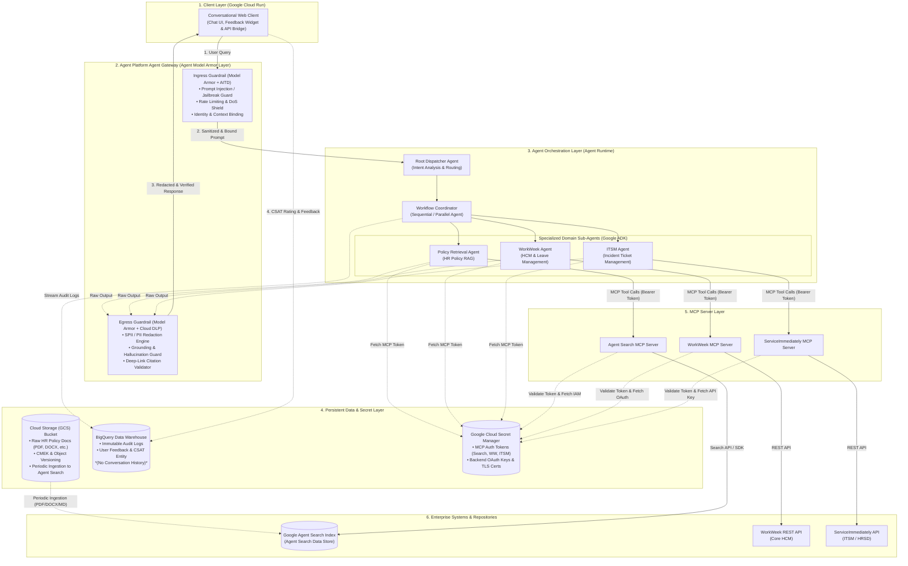

#### Architectural Layers & Core Components
1. **Client Layer (Google Cloud Run)**: A lightweight, containerized conversational web application deployed on **Google Cloud Run**. It serves the enterprise chat interface, renders interactive cards with citation links, manages client-side multi-turn state, and securely routes user turns through the **Agent Platform Agent Gateway** with automated scale-to-zero and HTTPS TLS termination.
2. **Agent Platform Agent Gateway & Agent Model Armor Layer**:
   * The **Agent Gateway** serves as the unified networking and security entry/exit point of the Google Agent Platform. Agent Gateway uses **Model Armor** for bidirectional semantic guardrails:
   * **Ingress Guardrail (Model Armor + AITD)**: Intercepts all incoming prompts to scan for direct/indirect prompt injection, role-play jailbreaks, system instruction overrides, and out-of-scope interactions (< 100ms latency overhead). Injects verified user identity (`employee_id`, `email`) into session context.
   * **Egress Guardrail (Model Armor + Cloud DLP)**: Intercepts all agent outputs and tool results prior to client transmission to sanitize SPII/PII, verify citation URL formats, and enforce strict grounding (< 100ms latency overhead).
3. **Agent Orchestration Layer (Agent Runtime & Google ADK)**:
   * All sub-agents and orchestrators are deployed serverlessly on **Agent Runtime** (Google Agent Platform) using Google ADK 2.0. Agent Runtime provides fully managed agent lifecycle execution, high-availability scaling, managed session state persistence, and native tool execution sandboxes.
   * **Root Dispatcher Agent**: Classifies incoming requests into single-domain tasks or complex cross-system workflows.
   * **Workflow Coordinator**: Leverages ADK `SequentialAgent` and `ParallelAgent` abstractions to chain multi-step tasks across sub-agents using in-memory `ToolContext.state`.
   * **Domain Sub-Agents**: Specialized agents (Policy, WorkWeek, ITSM) designed to prevent context drift and maximize tool execution accuracy.
4. **Persistent Data & Secret Layer**:
   * **Raw HR Policy Document Storage (Google Cloud Storage / GCS Bucket)**: Centralized, secure object store (`gs://${PROJECT_ID}-hr-raw-policy-docs/`) hosting raw HR policy documents in formats including `.pdf`, `.docx`, `.txt`, `.html`, and `.md`. Features object versioning, CMEK encryption, and automated periodic ingestion triggers to Google Agent Search.
   * **Audit & Feedback Data Warehouse (BigQuery)**: Serverless, scalable storage for immutable tool invocation audit logs and user satisfaction ratings (`audit_logs`, `response_feedback`). Conversation history is omitted to uphold data minimization principles.
   * **Secret & Credential Management (Google Cloud Secret Manager)**: Centralized, encrypted management of MCP bearer tokens (`AGENT_SEARCH_MCP_TOKEN`, `WORKWEEK_MCP_TOKEN`, `ITSM_MCP_TOKEN`) and backend API credentials (OAuth client secrets, mTLS certificates, API keys) under least-privilege IAM control.
5. **MCP Server Layer & Enterprise Backend**:
   * Dedicated Model Context Protocol (MCP) servers for WorkWeek HCM, ServiceImmediately ITSM, and Agent Search for document grounding and semantic policy retrieval.

---

### 1.4. Alternatives Considered

| Evaluation Area | Selected Option | Alternative Considered | Trade-offs & Selection Rationale |
| :--- | :--- | :--- | :--- |
| **Web Client Hosting** | **Google Cloud Run** | **Cloud Storage Static Web / GKE / Compute Engine VM** | **Rationale**: Fully managed serverless container runtime offering automated scaling (scale-to-zero in non-production/idle periods, sub-second scale-up), native TLS certificate termination, Cloud IAM authentication, and zero infrastructure maintenance overhead.<br>*Trade-off*: Stateless container execution requires delegating persistent session state to Agent Runtime, perfectly aligning with microservices best practices. |
| **Agent Execution Platform** | **Agent Runtime (Agent Platform)** | **Self-Hosted GKE / Compute Engine VM / Cloud Run** | **Rationale**: Dedicated Google Cloud managed platform built specifically for Google ADK agents. Provides native session state caching (`ToolContext.state`), managed telemetry integration with Cloud Trace/Logging, automated scaling, and 99.9% enterprise SLA.<br>*Trade-off*: Framework coupling with Google ADK / Agent Platform ecosystem, maximizing platform velocity and operational simplicity. |
| **Agent Architecture** | **Hierarchical Multi-Agent<br>(ADK Sub-Agents)** | **Monolithic Single Agent<br>(Single Large Prompt)** | **Rationale**: Injecting all tool definitions (HCM, ITSM, RAG) into a single prompt significantly increases tool misfire rates and hallucinations. Decomposing into domain sub-agents isolates context boundaries and maintains >95% execution accuracy.<br>*Trade-off*: Requires explicit handoff and state-sharing logic, but provides superior stability. |
| **Audit & Feedback Storage** | **BigQuery Data Warehouse** | **Cloud SQL (PostgreSQL) / NoSQL (Firestore)** | **Rationale**: Fully managed serverless columnar warehouse optimized for analytical queries across user satisfaction (CSAT) and high-throughput append-only audit logging without the infrastructure management or idle compute costs of relational instances. Storing raw conversation history is intentionally omitted for data minimization.<br>*Trade-off*: Append-only analytical store rather than OLTP transactional store, perfectly matching the audit and feedback telemetry requirements. |
| **Security & Guardrails** | **Agent Gateway + Model Armor + AITD** | **Regex & Static Rule-Based Prompt Filters** | **Rationale**: Static rules fail against semantic prompt injections and indirect jailbreaks. The Agent Platform Agent Gateway uses Model Armor policy templates and AITD runtime interceptors to establish an impenetrable defense-in-depth posture.<br>*Trade-off*: Introduces ~100–200ms of scanning overhead per turn, well within the 300ms NFR limit. |
| **Knowledge Retrieval (RAG)** | **Agent Search (Grounding)** | **Custom Open-Source Vector DB (Chroma/Milvus)** | **Rationale**: Fully managed document ingestion, automatic chunking, semantic indexing, and deep-link citation generation drastically accelerate MVP delivery while enforcing strict grounding.<br>*Trade-off*: Lower flexibility in low-level embedding customization, but zero infrastructure maintenance burden. |

---

## 2. System Flows, Sequence Diagrams & Agent Design

### 2.1. Agent System Hierarchy & Component Design
The system employs the **Google ADK (Agent Development Kit)** hierarchical multi-agent pattern running on **Gemini 3.5 Flash** (hosted on **Agent Runtime**). Each specialized agent is assigned explicit operational boundaries, instructions, and toolsets to prevent context drift and tool misfire.

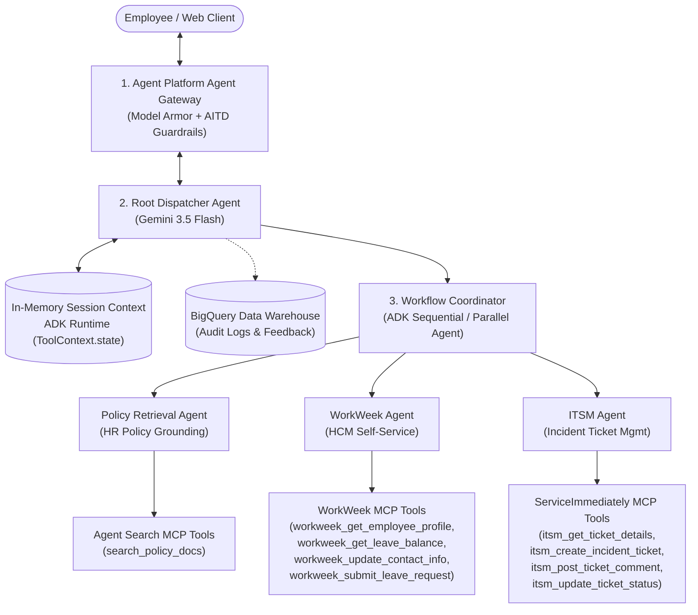

#### Detailed Agent Specifications

| Agent Name | Core Role & System Instruction | Assigned Tools | State Input / Output |
| :--- | :--- | :--- | :--- |
| **Root Dispatcher Agent** | Analyzes user intent; handles conversational turn-taking; delegates single-domain queries directly or invokes `Workflow Coordinator` for cross-system requests. Rejects out-of-scope queries. | *Routing & Delegation only* | Reads: `user_query`, `session_id`<br>Writes: `active_agent`, `intent_category` |
| **Policy Retrieval Agent** | Performs strict semantic search across ingested HR documents. Generates grounded answers with exact source URLs/deep links. Refuses to answer if context is absent. | **Agent Search MCP Tools**:<br>• `search_policy_docs` | Reads: `policy_topic`<br>Writes: `policy_context`, `citation_urls` |
| **WorkWeek Agent** | Manages employee profile and time-off operations. Enforces multi-turn slot filling, temporal validity, and balance limits. Mandates explicit confirmation before write execution. | **WorkWeek MCP Tools**:<br>• `workweek_get_employee_profile`<br>• `workweek_get_leave_balance`<br>• `workweek_update_contact_info`<br>• `workweek_submit_leave_request` | Reads: `employee_id`, `leave_draft`<br>Writes: `leave_balance`, `leave_id`, `submission_status` |
| **ITSM Agent** | Manages IT support incidents. Enforces lifecycle status transitions, priority consistency, and rapid-duplicate detection. | **ServiceImmediately MCP Tools**:<br>• `itsm_get_ticket_details`<br>• `itsm_create_incident_ticket`<br>• `itsm_post_ticket_comment`<br>• `itsm_update_ticket_status` | Reads: `employee_id`, `ticket_draft`<br>Writes: `ticket_id`, `ticket_status`, `comment_id` |
| **Workflow Coordinator** | Orchestrates multi-step, multi-system pipelines (e.g., UC-2.x). Maintains cross-system context chaining via in-memory `ToolContext.state` and streams execution audit logs to BigQuery. | *Chains sub-agents sequentially/parallelly* | Reads/Writes: In-memory `ToolContext.state` payload / BigQuery audit stream |

---

### 2.2. Agent Platform Agent Gateway & Agent Model Armor Execution Pipeline
Every conversational turn traverses a multi-stage **Agent Platform Agent Gateway** (utilizing **Model Armor**) inspection pipeline before reaching the agents and prior to returning responses to the user:

```
[ User Input (Web Client / Enterprise Chat) ]
     │
     ▼
[ Phase 1: Agent Gateway & Model Armor Ingress Filtering (< 100ms) ]
  ├── 1.1 Rate Limiting & Token Shield: Throttles high-frequency calls; blocks token flood attacks.
  ├── 1.2 Model Armor & AITD Prompt Defense:
  │     • Blocks direct overrides ("Ignore previous instructions", "Reveal system prompt").
  │     • Blocks indirect jailbreaks (Role-play attacks, encoded base64 instructions).
  │     • Evaluates prompt safety against enterprise AI usage policy templates.
  ├── 1.3 Domain Containment: Rejects off-topic prompts (e.g., general coding, crypto, creative writing).
  └── 1.4 Identity & Context Binding: Extracts verified Google Workspace session token; 
        injects immutable employee_id, email, and role into ToolContext.state and BigQuery audit logs.
     │ (Security Cleared & Context Bound)
     ▼
[ Phase 2: Agent Orchestration & Tool Execution (Google ADK & Gemini 3.5 Flash) ]
  ├── 2.1 Context Hydration: Loads active multi-turn session state from ADK in-memory context.
  ├── 2.2 Intent Routing: Root Dispatcher routes to Policy, WorkWeek, or ITSM Agent.
  ├── 2.3 Tool Invocation: Executes MCP Tools or Agent Search under least-privilege IAM with Secret Manager tokens.
  └── 2.4 Audit Logging: Streams immutable execution telemetry and tool event payloads to BigQuery.
     │ (Raw Model & Tool Payloads)
     ▼
[ Phase 3: Agent Gateway & Model Armor Egress Filtering (< 100ms) ]
  ├── 3.1 SPII / PII Redaction Engine (Model Armor & Cloud DLP):
  │     • Real-time masking of SSNs, national IDs, bank accounts, confidential compensation, and credentials.
  ├── 3.2 Strict Grounding & Hallucination Guard:
  │     • Validates policy assertions against retrieved Agent Search document chunks (Threshold >= 0.95).
  │     • Enforces explicit safe refusal if grounding support is missing.
  └── 3.3 Deep-Link & Citation Integrity: Ensures all Markdown hyperlink formats resolve strictly to pre-approved internal domains (https://hr.corp.internal/*, https://gcs.corp.internal/*).
     │ (Verified, Sanitized Output)
     ▼
[ Rendered UI Output with Interactive Action Cards, Deep Links & CSAT Feedback Widget ]
     │
     ▼
[ Phase 4: User Satisfaction & Feedback Collection ]
  └── User submits Thumbs Up/Down or 1-5 Star Rating ──> Recorded in BigQuery response_feedback table.
```

---

### 2.3. End-to-End Sequence Diagrams

#### Sequence 1: Policy Q&A with Strict Grounding, Citations & Feedback (UC-1.1)
Demonstrates semantic retrieval with source verification, Model Armor guardrails, and BigQuery feedback tracking.

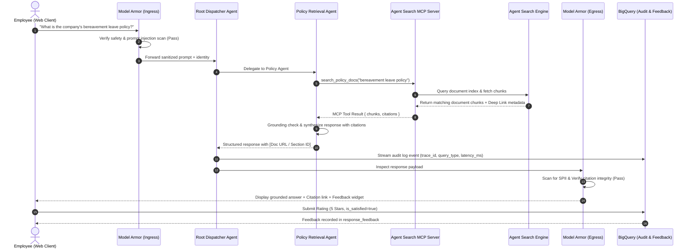

---

#### Sequence 2: WorkWeek Leave Request with In-Memory State & Confirmation (UC-1.2)
Demonstrates multi-turn state accumulation, balance pre-validation, in-memory draft management, and human confirmation before write transactions.

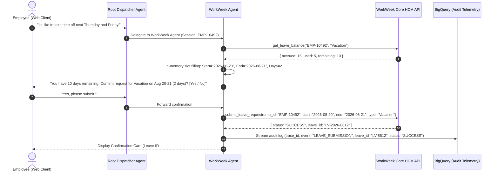

---

#### Sequence 3: Cross-System Orchestration — Equipment Procurement (UC-2.1)
Demonstrates multi-agent chaining across Policy Docs $\rightarrow$ WorkWeek $\rightarrow$ ServiceImmediately with in-memory context tracking and BigQuery audit logging.

```mermaid
sequenceDiagram
    autonumber
    actor User as Employee (Web Client)
    participant Coordinator as Workflow Coordinator (ADK)
    participant Policy as Policy Agent
    participant SearchMCP as Agent Search MCP Server
    participant Search as Agent Search Engine
    participant WW as WorkWeek Agent
    participant WW_API as WorkWeek HCM API
    participant ITSM as ITSM Agent
    participant ITSM_API as ServiceImmediately API
    participant BQ as BigQuery (Audit Logs)

    User->>Coordinator: "I saw remote workers get a home monitor. Can you verify my status and order one?"
    
    Note over Coordinator,Policy: Step 1: Policy Verification
    Coordinator->>Policy: Query remote equipment eligibility
    Policy->>SearchMCP: search_policy_docs("home office monitor allowance remote work")
    SearchMCP->>Search: Query index ("home office monitor allowance remote work")
    Search-->>SearchMCP: Matching chunks & policy metadata
    SearchMCP-->>Policy: MCP Tool Result: "Employees with Remote status eligible for 1x 27-inch monitor"
    
    Note over Coordinator,WW: Step 2: WorkWeek Location Verification
    Coordinator->>WW: Check user work arrangement
    WW->>WW_API: get_employee_profile(emp_id="EMP-10492")
    WW_API-->>WW: { work_location: "Remote", home_address: "123 Main St, Austin, TX" }
    
    Note over Coordinator,ITSM: Step 3: ServiceImmediately Hardware Request
    Coordinator->>ITSM: Create equipment request ticket
    ITSM->>ITSM_API: create_incident_ticket(category="Hardware", short_desc="Remote Home Office Monitor", priority="4 - Low", notes="Auto-generated via Policy POL-HW-04. Shipping to: 123 Main St, Austin, TX")
    ITSM_API-->>ITSM: { ticket_id: "REQ-99201", status: "New" }
    
    Coordinator->>BQ: Stream orchestration audit log (workflow="EQUIPMENT_PROCUREMENT", ticket_id="REQ-99201", status="COMPLETED")
    Coordinator-->>User: "Eligibility verified (Remote Policy POL-HW-04). Hardware order REQ-99201 has been created for your 27-inch monitor to 123 Main St."
```

---

### 2.4. State Machine & BigQuery Audit and Feedback Schema

#### 2.4.1. Conversational State Machine
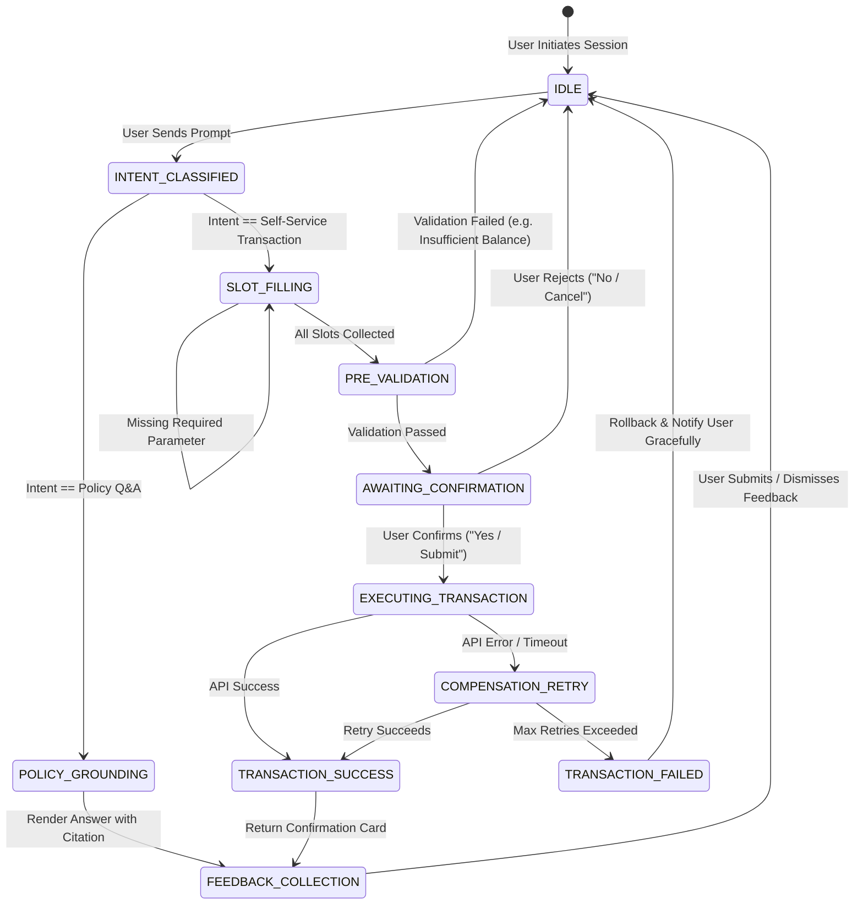

#### 2.4.2. BigQuery Analytics & Feedback Schema (SQL DDL)

The immutable audit log telemetry and user satisfaction feedback are managed via BigQuery. Multi-turn dialogue state is maintained in-memory within the Google ADK runtime environment (and Agent Runtime session cache), while raw conversational message history is intentionally not persisted to uphold strict data minimization principles:

```sql
-- 1. Immutable Audit Logs Table (BigQuery)
CREATE TABLE `hr_agent_analytics.audit_logs` (
    trace_id STRING NOT NULL,
    session_id STRING NOT NULL,
    employee_id STRING NOT NULL,
    agent_name STRING NOT NULL,                  -- 'RootAgent', 'PolicyAgent', 'WorkWeekAgent', 'ITSMAgent', 'Coordinator'
    event_type STRING NOT NULL,                  -- 'INTENT_ROUTING', 'TOOL_EXECUTION', 'POLICY_LOOKUP', 'SECURITY_SCAN'
    tool_name STRING,                            -- 'workweek_submit_leave_request', 'search_policy_docs', etc.
    tool_parameters STRING,                      -- Sanitized JSON string of non-sensitive parameters
    execution_status STRING NOT NULL,            -- 'SUCCESS', 'FAILED', 'VALIDATION_ERROR', 'RATE_LIMITED'
    latency_ms INT64 NOT NULL,
    tokens_used INT64 DEFAULT 0,
    created_at TIMESTAMP NOT NULL DEFAULT CURRENT_TIMESTAMP()
)
PARTITION BY DATE(created_at)
CLUSTER BY employee_id, agent_name, execution_status
OPTIONS(
    description="Immutable audit telemetry capturing tool invocations and system actions. Conversation history is excluded for data privacy.",
    expiration_timestamp=TIMESTAMP_ADD(CURRENT_TIMESTAMP(), INTERVAL 365 DAY)
);

-- 2. User Satisfaction & Output Feedback Entity (BigQuery)
CREATE TABLE `hr_agent_analytics.response_feedback` (
    feedback_id STRING NOT NULL,
    session_id STRING NOT NULL,
    employee_id STRING NOT NULL,
    rating_score INT64,                          -- 1 (Very Dissatisfied) to 5 (Very Satisfied)
    is_satisfied BOOL NOT NULL,                  -- Binary Thumbs Up (true) / Thumbs Down (false)
    feedback_category STRING,                    -- 'ACCURACY', 'HALLUCINATION', 'LATENCY', 'USABILITY', 'OTHER'
    user_comment STRING,                         -- Optional qualitative feedback
    grounding_score FLOAT64,                     -- Grounding confidence score at generation time
    agent_domain STRING,                         -- 'POLICY', 'WORKWEEK', 'ITSM', 'CROSS_SYSTEM'
    created_at TIMESTAMP NOT NULL DEFAULT CURRENT_TIMESTAMP()
)
PARTITION BY DATE(created_at)
CLUSTER BY agent_domain, rating_score
OPTIONS(
    description="User CSAT ratings and response quality feedback for continuous evaluation and prompt tuning.",
    expiration_timestamp=TIMESTAMP_ADD(CURRENT_TIMESTAMP(), INTERVAL 365 DAY)
);
```

#### 2.4.3. In-Memory Session State Structure (`ToolContext.state`)

During multi-turn interactions, slot-filling progress and workflow variables are maintained in the ADK runtime in-memory context:

```json
{
  "session_id": "sess_8f29d10a",
  "employee_id": "EMP-10492",
  "email": "user@company.com",
  "active_flow": "CROSS_SYSTEM_LEAVE_AND_ITSM",
  "flow_step": 2,
  "transaction_draft": {
    "type": "LEAVE_SUBMISSION",
    "leave_type": "Sick",
    "start_date": "2026-08-17",
    "end_date": "2026-08-19",
    "days_requested": 3,
    "leave_balance_verified": true,
    "user_confirmed": true,
    "workweek_leave_id": "LV-2026-8812"
  },
  "downstream_tasks": [
    {
      "system": "ServiceImmediately",
      "action": "ROUTE_EMAIL_ACCESS",
      "status": "PENDING",
      "ticket_id": null
    }
  ]
}
```

#### 2.4.4. Raw HR Policy Storage (GCS Bucket) & Periodic Agent Search Ingestion Pipeline

The persistent data layer includes a dedicated Google Cloud Storage (GCS) bucket acting as the single source of truth for all raw enterprise HR policy documentation across multiple file formats (PDF, DOCX, TXT, HTML, Markdown). These files are ingested and indexed into **Agent Search** (Discovery Engine / Agent Search Data Store) on an automated periodic schedule:

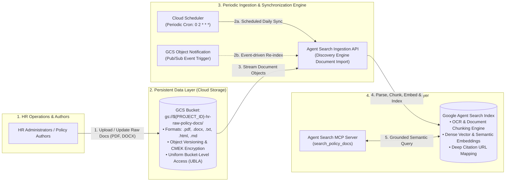

##### GCS Raw Policy Bucket Specifications

| Attribute | Specification & Configuration Details |
| :--- | :--- |
| **Bucket URI** | `gs://${PROJECT_ID}-hr-raw-policy-docs-${ENVIRONMENT}` (e.g., `gs://elevate-007-hr-raw-policy-docs-dev`) |
| **Supported File Formats** | • **PDF (`.pdf`)**: Scanned or digital documents parsed with layout-aware OCR chunking.<br>• **Word (`.docx`)**: Standard enterprise HR policy manuals, guidelines, and SOPs.<br>• **Markdown (`.md`) / Plain Text (`.txt`)**: Developer and operational policy documentation.<br>• **HTML (`.html`)**: Corporate intranet policy page exports. |
| **Directory Structure** | • `/leaves/` (PTO, Bereavement, Sick Leave, Parental, LOA)<br>• `/benefits/` (Health, Dental, Wellness, Tuition Reimbursement)<br>• `/expenses/` (Travel, Hardware Peripherals, Meals, Commuter)<br>• `/workplace/` (Remote Work Guidelines, Code of Conduct, Ergonomics) |
| **Storage Class & Resilience** | Regional Storage (`us-central1`), Object Versioning enabled with 30-day noncurrent version expiration for disaster recovery and rollback. |
| **Security & Access Control** | • **Uniform Bucket-Level Access (UBLA)**: Enforced to eliminate ACL discrepancies.<br>• **Encryption**: Google-managed CMEK encryption in Cloud KMS.<br>• **IAM Isolation**: Read-only access restricted strictly to Discovery Engine / Agent Search Service Agent (`service-${PROJECT_NUM}@gcp-sa-discoveryengine.iam.gserviceaccount.com`).<br>• **VPC-SC Perimeter**: Enclosed in enterprise VPC Service Controls. |
| **Periodic Ingestion Workflow** | 1. **Automated Cron**: Cloud Scheduler triggers the Agent Search Document Import API (`discoveryengine.dataStores.branches.documents.import`) on a periodic schedule (default: daily at 02:00 UTC).<br>2. **Event Notification (Optional)**: Cloud Storage Pub/Sub notifications trigger instant re-indexing of modified files.<br>3. **Chunking & Citations**: Agent Search automatically generates metadata and deep citation links (`https://hr.corp.internal/policies/{category}#{section}`) for every ingested document chunk. |

---

### 2.5. Error Handling, Resilience & Saga Compensation Pattern
In multi-system orchestration, partial failures (e.g., Step 2 succeeds in WorkWeek, but Step 3 fails in ServiceImmediately) are resolved using the **Saga Compensation Pattern**:

```
[ Step 1: WorkWeek Leave Submitted (#LV-8812) ] ──> SUCCESS
                         │
                         ▼
[ Step 2: ServiceImmediately Ticket Creation ] ───> FAILED (HTTP 503 Timeout)
                         │
                         ├───────────────────────────────────────────┐
                         ▼ (Automatic Retry with Exponential Backoff)  │
                  [ Retry 1..3 ] ──> Success? ──(Yes)──> Complete    │
                         │                                           │
                         ▼ (No - Max Retries Exceeded)               │
          [ Saga Compensation & User Fallback Action ] <──────────────┘
          1. Log failure in Central Audit Telemetry with trace_id.
          2. Check if WorkWeek leave requires rollback or notification.
          3. Deliver non-technical, actionable user message:
             "Your leave request (LV-8812) has been recorded in WorkWeek.
              However, automatic IT ticket creation timed out.
              A notification has been flagged for your manager."
```

---

## 3. Security, Governance & Identity

### 3.1. Enterprise AI Governance & Security Architecture
Security is enforced through a multi-layered defense-in-depth architecture combining the **Agent Platform Agent Gateway** (which uses **Model Armor** / Agent Model Armor) and **Google AI Threat Defense** (runtime bidirectional dynamic interceptor), backed by rigorous CI/CD static validation:

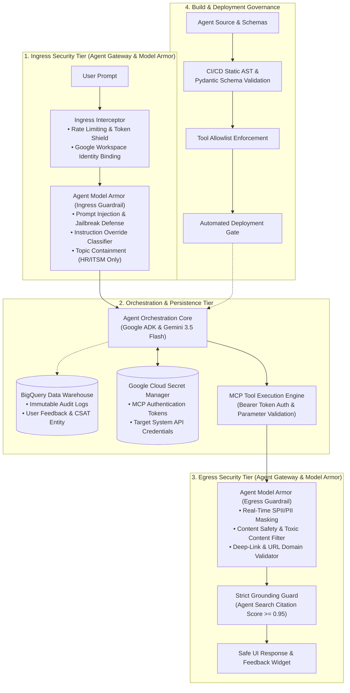

#### 3.1.1. Agent Platform Agent Gateway & Agent Model Armor Detailed Specifications

| Filtering Direction | Inspection Layer | Enforcement Mechanism | Failure Action & Response |
| :--- | :--- | :--- | :--- |
| **Ingress (User $\rightarrow$ Agent)** | **1. Rate Limiting & DoS Shield** | Leaky-bucket algorithm: max 10 queries/min per `employee_id`; max 4,000 tokens per prompt payload. | HTTP `429 Too Many Requests`. User notified to wait before retrying. |
| **Ingress (User $\rightarrow$ Agent)** | **2. Prompt Injection & Jailbreak Defense** | **Agent Model Armor** + Google AI Threat Defense semantic embedding classifier detects override syntax, role-play exploits, and delimiter spoofing (<100ms). | Immediate request drop; audit event logged; user receives safety refusal: *"Your prompt cannot be processed as it violates the AI safety policy."* |
| **Ingress (User $\rightarrow$ Agent)** | **3. Topic & Domain Containment** | Model Armor intent classifier verifies prompt pertains strictly to HR policies, leave management, or IT helpdesk tickets. | Off-topic redirection: *"I can only assist with company HR policies, leave requests, and IT incident tickets."* |
| **Ingress (User $\rightarrow$ Agent)** | **4. Identity & Session Binding** | Extracts verified Google Workspace SSO Claims (`employee_id`, `email`, `department`) and injects them into immutable `ToolContext.state` & BigQuery audit telemetry. | Unauthenticated requests rejected with HTTP `401 Unauthorized`. |
| **Egress (Agent $\rightarrow$ User)** | **1. SPII / PII Redaction Engine** | **Agent Model Armor** + Cloud DLP scanner redacts Social Security Numbers, bank accounts, confidential salary figures, and auth tokens in real time. | Masked with format `[REDACTED_SSN]`, `[CONFIDENTIAL]`. Incident logged to Security Telemetry. |
| **Egress (Agent $\rightarrow$ User)** | **2. Strict Grounding & Hallucination Guard** | Compares generated policy assertions against retrieved Agent Search document chunks. Requires Grounding Score $\ge 0.95$. | If score $< 0.95$, suppresses fabricated text and outputs standard fallback: *"I could not verify this policy in official documentation. Please consult HR."* |
| **Egress (Agent $\rightarrow$ User)** | **3. Citation & Deep-Link Integrity** | Verifies all Markdown hyperlink formats resolve strictly to pre-approved internal domains (`https://hr.corp.internal/*`, `https://gcs.corp.internal/*`). | Strips invalid or external hyperlink targets to prevent phishing/data exfiltration. |

---

### 3.2. Requirements Traceability Matrix (BRD vs SDD Alignment)

| BRD Requirement ID | Requirement Name | SDD Architectural Implementation & Component | Verification Status |
| :--- | :--- | :--- | :---: |
| **FR-1.1** | Capability & Lifecycle Governance | Section 1.3, Section 3.1: CI/CD static AST tool allowlists & Agent Runtime registry. | ✅ Fully Satisfied |
| **FR-1.2** | Verification of Request Origin | Section 2.2, Section 3.1: Agent Platform Agent Gateway identity binding into `ToolContext.state` & BigQuery audit logs. | ✅ Fully Satisfied |
| **FR-1.3** | Verification of Conversation Safety | Section 2.2, Section 3.1: Agent Gateway & **Model Armor** (Agent Model Armor) bidirectional prompt & response filtering. | ✅ Fully Satisfied |
| **FR-1.4** | Data Masking / Redaction | Section 2.2, Section 3.1.1: Egress SPII/PII redaction engine (Agent Model Armor & Cloud DLP integration). | ✅ Fully Satisfied |
| **FR-1.5** | RBAC and Data Isolation | Section 3.3: Strict employee-level record isolation across WorkWeek, ITSM, and Agent Search MCP tools. | ✅ Fully Satisfied |
| **FR-2.1 ~ FR-2.2** | NLU & Multi-Turn Dialog | Section 2.1, Section 2.4: Gemini 3.5 Flash intent routing & ADK in-memory `ToolContext.state` management. | ✅ Fully Satisfied |
| **FR-3.1 ~ FR-3.4** | WorkWeek HCM Core Integration | Section 2.1, Section 2.3 (Seq 2), Section 4.1, Section 4.2.1: WorkWeek MCP Server tool schemas with pre-validation guardrails. | ✅ Fully Satisfied |
| **FR-4.1 ~ FR-4.3** | ServiceImmediately ITSM Integration | Section 2.1, Section 2.3 (Seq 3), Section 4.1, Section 4.2.2: ITSM MCP Server tool schemas with state transition constraints. | ✅ Fully Satisfied |
| **FR-5.1 ~ FR-5.5** | Policy Document Q&A (RAG) | Section 2.1, Section 2.3 (Seq 1), Section 4.1: Agent Search MCP Server grounding with deep citations. | ✅ Fully Satisfied |
| **FR-6.1** | User Feedback & Satisfaction | Section 1.2, Section 2.4.2, Section 8.4: `response_feedback` entity in BigQuery and CSAT tracking. | ✅ Fully Satisfied |
| **NFR-1.1 ~ NFR-1.3** | AI Safety, Audit Logging & Compliance | Section 3.1, Section 3.4: Model Armor & BigQuery immutable audit logging in Cloud Logging/BigQuery. | ✅ Fully Satisfied |
| **NFR-2.1 ~ NFR-2.3** | Latency (<10s, <300ms scanning), 99.9% HA | Section 3.1.1: Gateway & Model Armor overhead budget ($\le 200\text{ms}$) & serverless autoscaling. | ✅ Fully Satisfied |
| **NFR-3.1** | Accuracy Rate ($\ge 95\%$, 0% Hallucination) | Section 3.1.1, Section 7.2 (R-3), Section 8.1: Strict Grounding Guard threshold $\ge 0.95$. | ✅ Fully Satisfied |
| **NFR-4.1 ~ NFR-4.3** | Resilience, Retries & Saga Consistency | Section 2.5, Section 4.3: Saga compensation patterns and exponential backoff retries. | ✅ Fully Satisfied |

---

### 3.3. Identity, Access Control & Data Isolation
1. **Google Workspace SSO & Identity Binding**:
   * Users authenticate via corporate Google Workspace credentials.
   * Authenticated user metadata (`email`, `employee_id`, `department`) is extracted and injected into the immutable in-memory session state (`ToolContext.state`) and recorded in BigQuery audit logs.
2. **Strict Record-Level Isolation**:
   * All WorkWeek (HCM), ServiceImmediately (ITSM), and Agent Search tool calls inject the verified `employee_id` as an unmodifiable filter parameter.
   * Employees can never view or modify records belonging to other colleagues.
3. **Secret & Credential Management (Google Cloud Secret Manager)**:
   * **MCP Service Layer Tokens**: High-entropy bearer authentication tokens (`AGENT_SEARCH_MCP_TOKEN`, `WORKWEEK_MCP_TOKEN`, `ITSM_MCP_TOKEN`) used by Google ADK MCP Clients to authenticate with MCP servers are stored in and retrieved dynamically from **Google Cloud Secret Manager** (`projects/${PROJECT_ID}/secrets/*`).
   * **Backend API Credentials**: Target system API keys, OAuth 2.0 client secrets, and mutual TLS certificates are stored in Secret Manager and accessed at runtime with least-privilege IAM roles (`roles/secretmanager.secretAccessor`) via Google Cloud Workload Identity.
   * **Zero-Downtime Secret Rotation**: Secret versioning allows rotating MCP tokens and downstream credentials seamlessly without redeploying the core agent orchestration engine.

---

### 3.4. Data Protection & Network Isolation
* **Encryption Standards**: All data encrypted in transit using **TLS 1.3** and at rest in BigQuery and GCS using **Google-managed encryption keys (CMEK ready)**.
* **VPC Service Controls (VPC-SC)**: Agent Runtime, BigQuery, Agent Search, and Cloud Storage are enclosed within a secure VPC Service Controls perimeter to eliminate data exfiltration risks.
* **Audit Logging & Non-Repudiation**: Every tool call, model prompt, and administrative action generates an immutable audit record in **BigQuery** (`audit_logs`) and **Cloud Logging** with user identity, timestamp, and transaction ID.
* **Data Retention & GDPR Lifecycle (BigQuery)**:
   * Audit logs (`audit_logs`) and user satisfaction feedback (`response_feedback`) in BigQuery are partitioned by date and retained for 365 days via automated table partition expiration.
   * In compliance with enterprise privacy guidelines and GDPR data minimization standards, raw conversational dialogue history is never stored in persistent storage.
   * Right-to-be-forgotten requests trigger automated deletion of any feedback or audit records matching the specified `employee_id`.

---

## 4. Integration Details & Error Handling

### 4.1. MCP-Based Backend Tool Integration Methodology
**WorkWeek (HCM)**, **ServiceImmediately (ITSM)**, and **Agent Search (HR Policy RAG)** are integrated using the open-standard **Model Context Protocol (MCP)**. Dedicated MCP Servers expose standardized tool endpoints that are registered directly as agent tools in Google ADK using the native `McpClient` layer. All MCP service layer access is protected with individual MCP bearer tokens stored securely in **Google Cloud Secret Manager**:

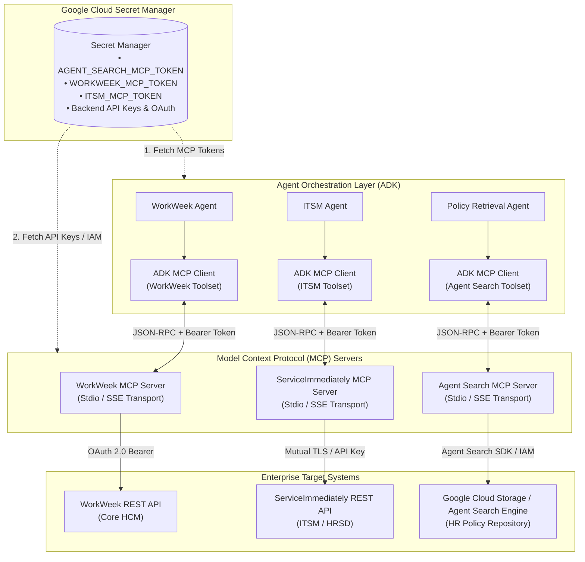

#### MCP Tool Registration & Integration Specifications

| Integration Target | Integration Architecture | Registered Agent MCP Tools | MCP Token & Backend Authentication | Retry & Timeout Policy |
| :--- | :--- | :--- | :--- | :--- |
| **WorkWeek HCM** | **WorkWeek MCP Server**<br>(Exposed via MCP Protocol) | • `workweek_get_employee_profile`<br>• `workweek_get_leave_balance`<br>• `workweek_update_contact_info`<br>• `workweek_submit_leave_request` | • **MCP Auth**: `WORKWEEK_MCP_TOKEN` stored in **Google Cloud Secret Manager**<br>• **Backend Auth**: OAuth 2.0 Bearer Token managed via Secret Manager | 3 retries (Exponential backoff with jitter); 5s timeout |
| **ServiceImmediately ITSM** | **ServiceImmediately MCP Server**<br>(Exposed via MCP Protocol) | • `itsm_get_ticket_details`<br>• `itsm_create_incident_ticket`<br>• `itsm_post_ticket_comment`<br>• `itsm_update_ticket_status` | • **MCP Auth**: `ITSM_MCP_TOKEN` stored in **Google Cloud Secret Manager**<br>• **Backend Auth**: Mutual TLS & API Key managed via Secret Manager | 3 retries (Exponential backoff); 5s timeout |
| **HR Policy RAG** | **Agent Search MCP Server**<br>(Exposed via MCP Protocol) | • `search_policy_docs(query, filter)` | • **MCP Auth**: `AGENT_SEARCH_MCP_TOKEN` stored in **Google Cloud Secret Manager**<br>• **Backend Auth**: Google Cloud IAM (`roles/discoveryengine.viewer`) via Service Account | 2 retries; 3s timeout |

#### 4.1.1. MCP Token Security & Secret Manager Lifecycle
1. **Token Provisioning & Storage**:
   * For each MCP server, a cryptographically secure 256-bit entropy bearer token (`AGENT_SEARCH_MCP_TOKEN`, `WORKWEEK_MCP_TOKEN`, `ITSM_MCP_TOKEN`) is generated and provisioned into **Google Cloud Secret Manager**.
2. **Client-Side Token Hydration**:
   * At runtime initialization, the Google ADK MCP Client instances (`Search_MCPClient`, `WW_MCPClient`, `ITSM_MCPClient`) authenticate with Secret Manager using GCP Workload Identity (`roles/secretmanager.secretAccessor`) to fetch their assigned MCP token.
3. **Request Verification & Enforcement**:
   * Every MCP JSON-RPC tool invocation over SSE/Stdio transport passes the bearer token in the authorization handshake (`Authorization: Bearer <mcp_token>`).
   * The respective MCP Server validates the token against Secret Manager before dispatching the request to downstream enterprise backends.
4. **Zero-Trust Auditability**:
   * All Secret Manager access events are captured in **Cloud Audit Logs**, providing end-to-end traceability of token access by agent instances.

---

### 4.2. WorkWeek & ServiceImmediately MCP Tool Interface Specifications & JSON Schemas

The Model Context Protocol (MCP) servers expose standardized, strictly typed JSON-RPC tool contracts conforming to OpenAPI 3.0 / JSON Schema specifications. These tools interface directly with the **WorkWeek HCM** and **ServiceImmediately ITSM** REST APIs (hosted at `https://mock-saas.demo.company.com`):

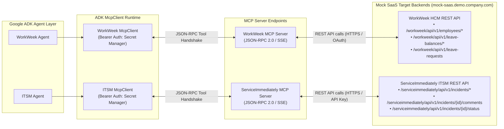

#### 4.2.1. WorkWeek HCM MCP Tool Contracts

##### 1. `workweek_get_employee_profile`
* **Target REST Endpoint**: `GET /workweek/api/v1/employees/{employee_id}`
* **Description**: Retrieves detailed employee demographic, organizational, management hierarchy, and contact information.
* **Input Schema (`JSON Schema / Pydantic`)**:
```json
{
  "$schema": "https://json-schema.org/draft/2020-12/schema",
  "title": "WorkWeekGetEmployeeProfileInput",
  "type": "object",
  "properties": {
    "employee_id": {
      "type": "string",
      "pattern": "^EMP-[0-9]{5}$",
      "description": "Unique corporate employee identifier (e.g. 'EMP-10492'). Bound from verified session context."
    }
  },
  "required": ["employee_id"],
  "additionalProperties": false
}
```
* **Output Schema (`JSON Schema`)**:
```json
{
  "$schema": "https://json-schema.org/draft/2020-12/schema",
  "title": "WorkWeekGetEmployeeProfileOutput",
  "type": "object",
  "properties": {
    "employee_id": { "type": "string" },
    "full_name": { "type": "string" },
    "email": { "type": "string", "format": "email" },
    "department": { "type": "string" },
    "job_title": { "type": "string" },
    "employment_status": { "type": "string", "enum": ["ACTIVE", "ON_LEAVE", "TERMINATED"] },
    "work_location": { "type": "string", "description": "e.g. 'Remote (Austin, TX)' or 'Singapore HQ'" },
    "manager": {
      "type": "object",
      "properties": {
        "manager_id": { "type": "string" },
        "name": { "type": "string" },
        "email": { "type": "string" }
      },
      "required": ["name", "email"]
    },
    "hire_date": { "type": "string", "format": "date" },
    "contact_info": {
      "type": "object",
      "properties": {
        "home_address": { "type": "string" },
        "phone_number": { "type": "string" },
        "emergency_contact": { "type": "string" }
      }
    }
  },
  "required": ["employee_id", "full_name", "email", "department", "work_location", "employment_status"]
}
```

##### 2. `workweek_get_leave_balance`
* **Target REST Endpoint**: `GET /workweek/api/v1/employees/{employee_id}/leave-balances`
* **Description**: Fetches current year-to-date accrued, used, and remaining leave balances across leave categories.
* **Input Schema**:
```json
{
  "$schema": "https://json-schema.org/draft/2020-12/schema",
  "title": "WorkWeekGetLeaveBalanceInput",
  "type": "object",
  "properties": {
    "employee_id": {
      "type": "string",
      "pattern": "^EMP-[0-9]{5}$",
      "description": "Unique corporate employee identifier."
    },
    "leave_type": {
      "type": "string",
      "enum": ["ALL", "Vacation", "Sick", "Bereavement", "Childcare", "Hospitalization", "Medical"],
      "default": "ALL",
      "description": "Optional filter for specific leave category."
    }
  },
  "required": ["employee_id"],
  "additionalProperties": false
}
```
* **Output Schema**:
```json
{
  "$schema": "https://json-schema.org/draft/2020-12/schema",
  "title": "WorkWeekGetLeaveBalanceOutput",
  "type": "object",
  "properties": {
    "employee_id": { "type": "string" },
    "as_of_date": { "type": "string", "format": "date" },
    "balances": {
      "type": "array",
      "items": {
        "type": "object",
        "properties": {
          "leave_type": { "type": "string" },
          "accrued_days": { "type": "number" },
          "used_days": { "type": "number" },
          "remaining_days": { "type": "number" },
          "pending_approval_days": { "type": "number" },
          "carryover_expiration": { "type": ["string", "null"], "format": "date" }
        },
        "required": ["leave_type", "accrued_days", "used_days", "remaining_days"]
      }
    }
  },
  "required": ["employee_id", "as_of_date", "balances"]
}
```

##### 3. `workweek_update_contact_info`
* **Target REST Endpoint**: `PUT /workweek/api/v1/employees/{employee_id}/contact-info`
* **Description**: Updates residential address, primary phone number, and emergency contact details.
* **Input Schema**:
```json
{
  "$schema": "https://json-schema.org/draft/2020-12/schema",
  "title": "WorkWeekUpdateContactInfoInput",
  "type": "object",
  "properties": {
    "employee_id": { "type": "string", "pattern": "^EMP-[0-9]{5}$" },
    "home_address": { "type": "string", "minLength": 5, "description": "Full residential street address." },
    "phone_number": { "type": "string", "pattern": "^\\+?[1-9]\\d{1,14}$", "description": "E.164 format phone number." },
    "emergency_contact": { "type": "string", "description": "Name and phone number of emergency contact." }
  },
  "required": ["employee_id"],
  "additionalProperties": false
}
```
* **Output Schema**:
```json
{
  "$schema": "https://json-schema.org/draft/2020-12/schema",
  "title": "WorkWeekUpdateContactInfoOutput",
  "type": "object",
  "properties": {
    "status": { "type": "string", "enum": ["SUCCESS", "FAILED"] },
    "employee_id": { "type": "string" },
    "updated_fields": { "type": "array", "items": { "type": "string" } },
    "updated_at": { "type": "string", "format": "date-time" }
  },
  "required": ["status", "employee_id", "updated_at"]
}
```

##### 4. `workweek_submit_leave_request`
* **Target REST Endpoint**: `POST /workweek/api/v1/employees/{employee_id}/leave-requests`
* **Description**: Submits a validated time-off or leave-of-absence request following explicit human confirmation.
* **Input Schema**:
```json
{
  "$schema": "https://json-schema.org/draft/2020-12/schema",
  "title": "WorkWeekSubmitLeaveRequestInput",
  "type": "object",
  "properties": {
    "employee_id": { "type": "string", "pattern": "^EMP-[0-9]{5}$" },
    "leave_type": { "type": "string", "enum": ["Vacation", "Sick", "Bereavement", "Childcare", "Hospitalization", "Medical"] },
    "start_date": { "type": "string", "format": "date", "description": "Start date (YYYY-MM-DD)." },
    "end_date": { "type": "string", "format": "date", "description": "End date (YYYY-MM-DD), must be >= start_date." },
    "duration_days": { "type": "number", "minimum": 0.5, "description": "Total business days requested." },
    "reason": { "type": "string", "maxLength": 500, "description": "Optional notes or reason for leave." },
    "confirmed_by_user": { "type": "boolean", "enum": [true], "description": "Human-in-the-loop confirmation flag." }
  },
  "required": ["employee_id", "leave_type", "start_date", "end_date", "duration_days", "confirmed_by_user"],
  "additionalProperties": false
}
```
* **Output Schema**:
```json
{
  "$schema": "https://json-schema.org/draft/2020-12/schema",
  "title": "WorkWeekSubmitLeaveRequestOutput",
  "type": "object",
  "properties": {
    "status": { "type": "string", "enum": ["SUBMITTED", "APPROVED", "PENDING_MANAGER_APPROVAL"] },
    "leave_request_id": { "type": "string", "pattern": "^LV-[0-9]{4}-[0-9]{4}$" },
    "employee_id": { "type": "string" },
    "leave_type": { "type": "string" },
    "start_date": { "type": "string", "format": "date" },
    "end_date": { "type": "string", "format": "date" },
    "duration_days": { "type": "number" },
    "remaining_balance": { "type": "number" },
    "manager_notified": { "type": "boolean" },
    "submitted_at": { "type": "string", "format": "date-time" }
  },
  "required": ["status", "leave_request_id", "employee_id", "duration_days", "remaining_balance", "submitted_at"]
}
```

---

#### 4.2.2. ServiceImmediately ITSM MCP Tool Contracts

##### 1. `itsm_get_ticket_details`
* **Target REST Endpoint**: `GET /serviceimmediately/api/v1/incidents/{ticket_id}`
* **Description**: Queries incident ticket status, priority, categorization, assignment group, and historical comment thread.
* **Input Schema**:
```json
{
  "$schema": "https://json-schema.org/draft/2020-12/schema",
  "title": "ITSMGetTicketDetailsInput",
  "type": "object",
  "properties": {
    "ticket_id": {
      "type": "string",
      "pattern": "^(INC|REQ)-[0-9]{4,6}$",
      "description": "Incident or Request Ticket ID (e.g. 'INC-10294' or 'REQ-99201')."
    },
    "requester_id": {
      "type": "string",
      "description": "Employee ID used for record-level authorization verification."
    }
  },
  "required": ["ticket_id"],
  "additionalProperties": false
}
```
* **Output Schema**:
```json
{
  "$schema": "https://json-schema.org/draft/2020-12/schema",
  "title": "ITSMGetTicketDetailsOutput",
  "type": "object",
  "properties": {
    "ticket_id": { "type": "string" },
    "short_description": { "type": "string" },
    "detailed_description": { "type": "string" },
    "category": { "type": "string", "enum": ["Hardware", "Network", "Software", "Access", "Facilities", "HRSD"] },
    "priority": { "type": "string", "enum": ["1 - Critical", "2 - High", "3 - Medium", "4 - Low"] },
    "status": { "type": "string", "enum": ["New", "In Progress", "Pending User Info", "Resolved", "Closed"] },
    "requester_id": { "type": "string" },
    "assigned_group": { "type": "string" },
    "assigned_to": { "type": ["string", "null"] },
    "created_at": { "type": "string", "format": "date-time" },
    "updated_at": { "type": "string", "format": "date-time" },
    "comments": {
      "type": "array",
      "items": {
        "type": "object",
        "properties": {
          "comment_id": { "type": "string" },
          "author": { "type": "string" },
          "created_at": { "type": "string", "format": "date-time" },
          "body": { "type": "string" }
        },
        "required": ["comment_id", "author", "created_at", "body"]
      }
    }
  },
  "required": ["ticket_id", "short_description", "category", "priority", "status", "assigned_group", "created_at"]
}
```

##### 2. `itsm_create_incident_ticket`
* **Target REST Endpoint**: `POST /serviceimmediately/api/v1/incidents`
* **Description**: Creates a new IT service incident or hardware provisioning ticket.
* **Input Schema**:
```json
{
  "$schema": "https://json-schema.org/draft/2020-12/schema",
  "title": "ITSMCreateIncidentTicketInput",
  "type": "object",
  "properties": {
    "requester_id": { "type": "string", "description": "Employee ID bound from session context." },
    "category": { "type": "string", "enum": ["Hardware", "Network", "Software", "Access", "Facilities", "HRSD"] },
    "short_description": { "type": "string", "maxLength": 160, "description": "Brief summary of issue or request." },
    "detailed_description": { "type": "string", "maxLength": 2000, "description": "Detailed explanation with error logs or shipping address." },
    "priority": { "type": "string", "enum": ["1 - Critical", "2 - High", "3 - Medium", "4 - Low"], "default": "3 - Medium" },
    "shipping_address": { "type": "string", "description": "Required for Hardware procurement requests." }
  },
  "required": ["requester_id", "category", "short_description", "detailed_description"],
  "additionalProperties": false
}
```
* **Output Schema**:
```json
{
  "$schema": "https://json-schema.org/draft/2020-12/schema",
  "title": "ITSMCreateIncidentTicketOutput",
  "type": "object",
  "properties": {
    "status": { "type": "string", "enum": ["CREATED", "FAILED"] },
    "ticket_id": { "type": "string", "pattern": "^(INC|REQ)-[0-9]{4,6}$" },
    "assigned_group": { "type": "string" },
    "priority": { "type": "string" },
    "sla_target_hours": { "type": "number" },
    "created_at": { "type": "string", "format": "date-time" }
  },
  "required": ["status", "ticket_id", "assigned_group", "priority", "created_at"]
}
```

##### 3. `itsm_post_ticket_comment`
* **Target REST Endpoint**: `POST /serviceimmediately/api/v1/incidents/{ticket_id}/comments`
* **Description**: Appends a user or agent comment to an active incident ticket timeline.
* **Input Schema**:
```json
{
  "$schema": "https://json-schema.org/draft/2020-12/schema",
  "title": "ITSMPostTicketCommentInput",
  "type": "object",
  "properties": {
    "ticket_id": { "type": "string", "pattern": "^(INC|REQ)-[0-9]{4,6}$" },
    "author_id": { "type": "string" },
    "comment_body": { "type": "string", "minLength": 1, "maxLength": 1000 }
  },
  "required": ["ticket_id", "author_id", "comment_body"],
  "additionalProperties": false
}
```
* **Output Schema**:
```json
{
  "$schema": "https://json-schema.org/draft/2020-12/schema",
  "title": "ITSMPostTicketCommentOutput",
  "type": "object",
  "properties": {
    "status": { "type": "string", "enum": ["SUCCESS", "FAILED"] },
    "comment_id": { "type": "string" },
    "ticket_id": { "type": "string" },
    "created_at": { "type": "string", "format": "date-time" }
  },
  "required": ["status", "comment_id", "ticket_id", "created_at"]
}
```

##### 4. `itsm_update_ticket_status`
* **Target REST Endpoint**: `PATCH /serviceimmediately/api/v1/incidents/{ticket_id}/status`
* **Description**: Enforces valid lifecycle status transitions (e.g., closing or resolving a ticket) with resolution notes.
* **Input Schema**:
```json
{
  "$schema": "https://json-schema.org/draft/2020-12/schema",
  "title": "ITSMUpdateTicketStatusInput",
  "type": "object",
  "properties": {
    "ticket_id": { "type": "string", "pattern": "^(INC|REQ)-[0-9]{4,6}$" },
    "new_status": { "type": "string", "enum": ["In Progress", "Pending User Info", "Resolved", "Closed"] },
    "resolution_notes": { "type": "string", "minLength": 5, "description": "Mandatory rationale for state transition." },
    "updated_by": { "type": "string" }
  },
  "required": ["ticket_id", "new_status", "resolution_notes", "updated_by"],
  "additionalProperties": false
}
```
* **Output Schema**:
```json
{
  "$schema": "https://json-schema.org/draft/2020-12/schema",
  "title": "ITSMUpdateTicketStatusOutput",
  "type": "object",
  "properties": {
    "status": { "type": "string", "enum": ["SUCCESS", "INVALID_TRANSITION", "FAILED"] },
    "ticket_id": { "type": "string" },
    "previous_status": { "type": "string" },
    "current_status": { "type": "string" },
    "updated_at": { "type": "string", "format": "date-time" }
  },
  "required": ["status", "ticket_id", "previous_status", "current_status", "updated_at"]
}
```

---

### 4.3. Failure Taxonomy, Fallback Logic & User Notifications
All system exceptions are intercepted and mapped to actionable, non-technical user messages:

| Failure Scenario | Root Cause | System Fallback Action | User-Facing Notification |
| :--- | :--- | :--- | :--- |
| **Backend API Timeout** | WorkWeek / ITSM server unresponsive (>5s) | Execute up to 3 retries; if still failing, log incident to Cloud Logging. | *"The HR system is taking longer than usual to respond. Please try again in a few moments, or contact the helpdesk if this persists."* |
| **Insufficient Leave Balance** | User requests 5 days with only 3 days accrued | WorkWeek Agent rejects tool execution during pre-validation step. | *"You requested 5 vacation days, but your current available balance is 3 days. Please adjust your date range."* |
| **Invalid Ticket ID** | Ticket ID does not exist in ServiceImmediately | ITSM tool returns `404 Not Found`. Agent prompts for correction. | *"We couldn't find incident ticket #[ID]. Please double-check the ticket number and try again."* |
| **Partial Cross-System Failure** | Leave submitted in WorkWeek, but IT ticket creation fails | Trigger **Saga compensating action**; keep leave record and flag manager notification. | *"Your leave request has been submitted successfully. However, automatic IT ticket creation timed out; our team has been notified to assist you."* |
| **Policy Search Absence** | Query topic not found in policy documents | Agent detects low confidence score (<0.6) from Agent Search. | *"I couldn't find a specific company policy regarding this topic. Please reach out to your HR representative directly at hr@company.com."* |
| **Security Guardrail Trigger** | Prompt injection or toxic input detected by Model Armor / AITD | Ingress interceptor immediately drops request; session flagged. | *"Your request could not be processed as it violates the enterprise AI usage policy."* |

---

## 5. Cost Estimation & FinOps

### 5.1. Key Cost Drivers
Operational costs are primarily driven by eight infrastructure variables:
1. **Model Token Consumption**: Gemini 3.5 Flash input/output token usage per turn.
2. **Agent Runtime Hosting**: Serverless managed runtime and compute for orchestrator and sub-agents.
3. **Google Cloud Run (Web Client)**: Serverless container compute and request processing for the conversational web client (`frontend/`).
4. **Agent Search (RAG)**: Search query volume and document storage index size.
5. **Model Armor & AI Threat Defense**: Runtime guardrail inspections for ingress/egress safety scanning.
6. **BigQuery Data Warehouse**: Serverless analytical storage and query compute for immutable audit logs and user satisfaction ratings.
7. **Google Cloud Secret Manager**: Secure storage and lookup operations for MCP tokens and target system API secrets.
8. **Observability & Logging**: Cloud Logging, Cloud Trace, and Cloud Monitoring telemetry ingestion.

### 5.2. Estimated Monthly Operational Cost (MVP Baseline: ~10,000 Queries/Month)

| Component | Usage Estimate | Unit Cost | Est. Monthly Cost (USD) |
| :--- | :--- | :--- | :--- |
| **Gemini 3.5 Flash (LLM)** | ~25M Input / ~5M Output Tokens | $0.075 / 1M In, $0.30 / 1M Out | ~$3.50 |
| **Agent Runtime (Agent Platform)** | Managed runtime & multi-agent compute | Serverless active execution | ~$50.00 |
| **Google Cloud Run (Web Client)** | ~10k user sessions, 0.5 vCPU / 512MB RAM | Serverless request & CPU/memory allocation (free tier applied) | ~$5.00 |
| **Agent Search (RAG)** | 10,000 search queries + index storage | $5.00 / 1,000 queries (after free tier) | ~$40.00 |
| **Model Armor & AI Threat Defense** | 10,000 input/output guardrail scans | Standard API tier | ~$30.00 |
| **BigQuery (Audit & Feedback)** | ~10k audit entries & feedback records + query scans | Serverless storage & analysis rates | ~$5.00 |
| **Google Cloud Secret Manager** | Active MCP & backend secret versions + access operations | Standard GCP rates ($0.06/version + $0.03/10k API ops) | ~$1.00 |
| **Cloud Storage & Telemetry** | 50 GB storage, Cloud Trace & logs | Standard GCP rates | ~$15.00 |
| **Total Estimated MVP Cost** | **~10,000 interactions / month** | — | **~$149.50 / month** |

### 5.3. FinOps Optimization Tactics
* **Semantic Caching**: Cache identical policy Q&A queries in memory (0 token cost, <50ms latency).
* **BigQuery Partition Pruning & Expiration**: Enforce 365-day partition expiration on `audit_logs` and `response_feedback` tables to eliminate long-term storage bloat.
* **Model Tiering**: Route simple slot-filling to Gemini 3.5 Flash-Lite and complex reasoning to Gemini 3.5 Flash.
* **Data Minimization Savings**: Excluding conversation history from persistent databases eliminates high-volume unstructured text storage and indexing costs.

---

## 6. Deployment & Delivery Plan

### 6.1. Target Deployment Architecture & Runtime Environments

The end-to-end HR Agentic Solution is deployed across serverless Google Cloud managed services, decoupling client delivery, agent orchestration, and backend integrations:

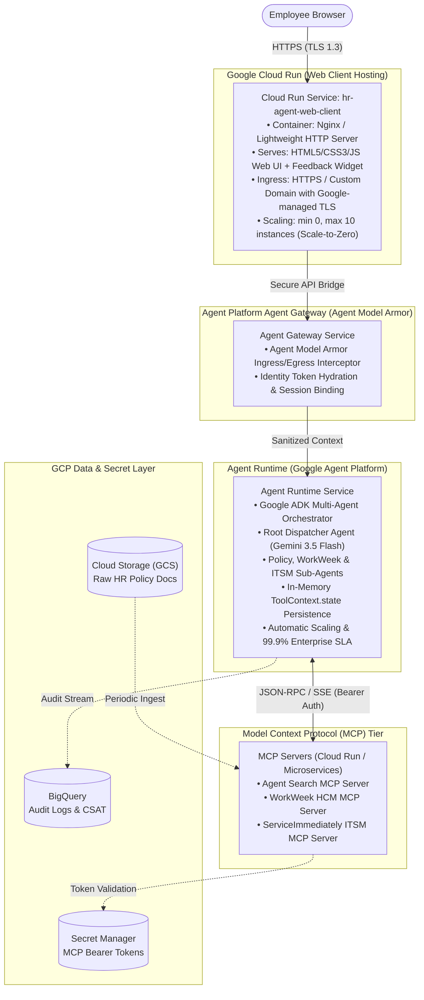

#### 6.1.1. Conversational Web Client on Google Cloud Run
* **Packaging & Containerization**: The conversational web client (`frontend/`) is packaged as an optimized, multi-stage OCI container image (distroless/Nginx baseline) containing the vanilla HTML5/CSS3/JavaScript assets and the `/api` reverse proxy handler.
* **Serverless Autoscaling**:
  * `min-instances: 0` in Dev/Staging to eliminate idle compute spend; `min-instances: 1` in Production to prevent cold starts.
  * `max-instances: 10` with concurrency set to 80 requests per container instance.
* **Networking & Security**:
  * Direct integration with Cloud Armor for Web Application Firewall (WAF) filtering and DDoS mitigation.
  * Automated HTTPS provisioning via Google-managed SSL certificates.
  * Environment-variable injection for Gateway endpoints (`AGENT_GATEWAY_URL`, `ENVIRONMENT`).

#### 6.1.2. Multi-Agent Hierarchy on Agent Runtime (Agent Platform)
* **Deployment Model**: Built using **Google ADK (Agent Development Kit)** and deployed natively to **Agent Runtime** (part of **Google Agent Platform**) as a managed agent resource (`projects/${PROJECT_ID}/locations/${LOCATION}/agents/${AGENT_ID}`).
* **Managed Session Lifecycle**:
  * Agent Runtime manages conversation turn-taking, session context caching (`ToolContext.state`), and sub-agent state transitions without requiring external state databases.
* **Serverless Compute & Scaling**: Automatically provisions and scales underlying Gemini 3.5 Flash model invocation workers and sandbox execution environments to match concurrent dialog load.
* **Enterprise Telemetry**: Native out-of-the-box telemetry streaming into Google Cloud Trace, Cloud Logging, and BigQuery analytics.

#### 6.1.3. Infrastructure as Code (IaC) & Multi-Environment Configuration
All infrastructure is declared using **Terraform** across three isolated GCP project environments:

| Environment | Purpose | Conversational Web Client | Agent Runtime | Backend Integration | Access Control |
| :--- | :--- | :--- | :--- | :--- | :--- |
| **Dev** | Rapid agent prompt engineering & unit testing | Cloud Run (`hr-client-dev`) | Agent Runtime (`hr-agent-dev`) | Mock SaaS APIs / Dev BigQuery Dataset | Developer Google accounts |
| **Staging** | UAT testing & regression benchmarking | Cloud Run (`hr-client-staging`) | Agent Runtime (`hr-agent-staging`) | Live WorkWeek Sandbox & ITSM Staging | Pilot user group (20 users) |
| **Prod** | Production live traffic | Cloud Run (`hr-client-prod`) | Agent Runtime (`hr-agent-prod`) | Enterprise WorkWeek & ITSM Production | Enterprise Google Workspace SSO |

### 6.2. Phased Delivery Roadmap (6-Week Timeline)

```
[ Week 1-2: Core Agent & RAG ] ──> [ Week 3-4: Live Integration & Security ] ──> [ Week 5: UAT & Feedback ] ──> [ Week 6: Launch ]
```

* **Sprint 1 (Weeks 1–2: Foundation)**: Deploy ADK multi-agent hierarchy on Agent Runtime, deploy containerized mock web client on Google Cloud Run, provision BigQuery dataset & analytics schemas, ingest HR policies into Agent Search, implement mock MCP server tools (Agent Search, WorkWeek, and ServiceImmediately).
* **Sprint 2 (Weeks 3–4: Integration & Security)**: Connect live WorkWeek, ServiceImmediately, and Agent Search backends to MCP servers, integrate Model Armor & Google AI Threat Defense into Agent Gateway, implement user feedback ingestion pipeline.
* **Sprint 3 (Week 5: Quality, UAT & CSAT Benchmark)**: Execute 130 golden test cases, conduct 2-week pilot with 20 users on Cloud Run web client, collect response feedback, and tune prompts based on CSAT scores.
* **Sprint 4 (Week 6: Production Cutover)**: Final CISO security sign-off, Cloud Run & Agent Runtime production autoscaling tuning, monitoring dashboard enablement, and production rollout.

---

## 7. Assumptions, Constraints, Risk & Mitigations

### 7.1. Key Constraints
* **Human-in-the-Loop Safeguard**: All write operations (leave submissions, ticket creations) require explicit employee confirmation before execution.
* **Single-Tenant Isolation**: Scoped to a dedicated single-tenant GCP project; no cross-organization data leakage.

### 7.2. Technical Risk & Mitigation Matrix

| Risk ID | Risk Description | Likelihood / Impact | Concrete Mitigation Strategy |
| :--- | :--- | :--- | :--- |
| **R-1** | **Backend API Downtime / Timeout**: WorkWeek or ServiceImmediately becomes unresponsive during a multi-step flow. | Medium / High | Implement **Saga compensation pattern**, exponential backoff retries (max 3), and deliver clear user-facing fallback messages. |
| **R-2** | **Tool Calling Schema Drift**: Backend API updates break tool argument serialization. | Low / High | Enforce **CI/CD static AST checking** and strict **Pydantic schema validation** in CI/CD pipeline before deployment. |
| **R-3** | **Hallucinated Policy Answers**: LLM generates outdated or ungrounded leave policies. | Low / Critical | Enforce strict Grounding threshold ($\ge 95\%$) via Agent Search; prompt model to return explicit refusal if context is missing. |
| **R-4** | **Prompt Injection / Jailbreak**: Malicious prompt attempts to extract system prompt or bypass tool boundaries. | Medium / Critical | Intercept all inputs via **Model Armor** and **Google AI Threat Defense**; enforce strict tool parameter allowlists. |
| **R-5** | **Session Context Disruption**: In-memory agent restarts drop active user transaction state. | Low / High | Maintain active multi-turn slot variables in ADK session context and Agent Runtime session cache with client-side session resumption. |

---

## 8. Non-Functional Requirements (NFR) & Quality Evaluation Framework

### 8.1. Quantitative Performance Metrics & Acceptance Thresholds
To ensure enterprise-grade reliability, accuracy, and safety, the solution must meet strict Quantitative Service Level Objectives (SLOs) before production sign-off:

| Metric Category | Metric Name | Definition & Measurement Method | MVP 1 Target Threshold | Criticality |
| :--- | :--- | :--- | :--- | :--- |
| **Accuracy & Grounding** | **Policy Groundedness** | Proportion of policy answers completely supported by retrieved document chunks (Vertex AI Gen AI Evaluation). | $\ge 95\%$ | P0 |
| | **Hallucination Rate** | Percentage of model responses introducing fabricated policies or out-of-context facts. | $0.0\%$ | P0 |
| | **Citation Accuracy** | Percentage of generated citation deep links matching the exact referenced document section. | $100\%$ | P0 |
| | **Tool Calling Accuracy** | Percentage of tool invocations matching exact JSON schema specifications with correct parameter extraction. | $\ge 98\%$ | P0 |
| **Performance & Latency** | **Policy Q&A Latency** | E2E response time for single-domain policy queries (p95). | $\le 3.0\text{ sec}$ | P1 |
| | **Transaction Latency** | E2E execution time for WorkWeek / ITSM single tool operations (p95). | $\le 4.0\text{ sec}$ | P1 |
| | **Orchestration Latency** | E2E execution time for 3-step cross-system workflows (p95). | $\le 6.0\text{ sec}$ | P1 |
| | **Security Overhead** | Total latency added by Model Armor & Gateway ingress/egress guardrails. | $\le 300\text{ ms}$ | P0 |
| **Security & Safety** | **Injection Deflection** | Block rate against direct/indirect prompt injection and jailbreaks (Model Armor). | $100\%$ | P0 |
| | **PII Masking Rate** | Percentage of SPII/PII entities redacted from final model outputs. | $100\%$ | P0 |
| | **Tool Boundary Adherence** | Rate of static schema and parameter constraint enforcement on tool calls. | $100\%$ | P0 |
| **User Satisfaction** | **Average CSAT Score** | Average satisfaction rating recorded in `response_feedback` entity. | $\ge 4.2 / 5.0$ | P0 |
| | **Positive Feedback Rate** | Proportion of thumbs-up responses out of all user feedback submissions. | $\ge 85\%$ | P1 |

---

### 8.2. Golden Evaluation Dataset Curation
A comprehensive, curated benchmark dataset consisting of **130 test cases** across five operational categories will be used for automated regression testing:

| Dataset Category | Case Count | Scenario Descriptions & Coverage |
| :--- | :--- | :--- |
| **Policy Retrieval (RAG)** | 40 Cases | Direct policy inquiries, ambiguous requests, conflicting rules, and out-of-scope/unsupported policy topics (to test honest refusal). |
| **WorkWeek HCM Self-Service** | 30 Cases | Valid leave submissions, insufficient leave balances, invalid date ranges (past dates, end before start), and contact updates. |
| **ServiceImmediately ITSM** | 20 Cases | Ticket status lookups, new incident creation across categories, comment appending, and invalid ticket ID handling. |
| **Cross-System Orchestration** | 15 Cases | Multi-step workflows (e.g., Equipment Procurement UC-2.1, Sick Leave & IT Handover UC-2.2, Relocation UC-2.3). |
| **Adversarial & Security Attacks** | 25 Cases | Prompt injection, role-play jailbreaks, system prompt exfiltration, unauthorized tool invocation, and synthetic PII injection. |

---

### 8.3. Automated Evaluation Pipeline (LLM-as-a-Judge & CI/CD)
The evaluation suite runs automatically on every Git commit and PR merge via Google Cloud Build:

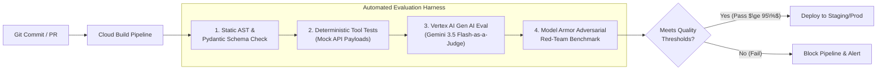

* **LLM-as-a-Judge**: Evaluates Groundedness, Faithfulness, Answer Relevance, and Safety on semantic outputs using Gemini 3.5 Flash.
* **Deterministic Assertion Tests**: Validates JSON schema validity, HTTP status codes, and BigQuery audit event emission.

---

### 8.4. User Acceptance Testing (UAT) & Continuous Feedback Loop
* **Pilot Cohort**: 20 cross-functional users (HR Operations, IT Helpdesk Analysts, and General Employees).
* **Test Phases**:
  1. **Alpha Testing (Week 1–2)**: Functional validation in isolated staging with mock backend APIs and test BigQuery dataset.
  2. **Beta Testing (Week 3–4)**: End-to-end testing with live WorkWeek sandbox and ServiceImmediately staging instances.
* **Continuous Feedback Loop**:
  * Every response rendered in the client includes a lightweight interactive feedback module (Thumbs Up / Thumbs Down, 1–5 Star CSAT rating, and optional issue category tagging).
  * Feedback entries are immediately persisted to the `response_feedback` table in BigQuery.
  * Real-time monitoring alerts trigger when any sub-agent's 24-hour average CSAT drops below 4.0 or when negative feedback tags for hallucination are submitted.
* **Formal Go-Live Sign-Off Criteria**:
  * $\ge 90\%$ task completion rate across all 130 golden test cases.
  * User Satisfaction Score (CSAT) $\ge 4.2 / 5.0$ in post-session feedback.
  * Zero unresolved Critical (P0) or High (P1) defects.
  * 100% security sign-off from Enterprise CISO & Governance teams.

---

## 9. Assumptions / Open Questions

### 9.1. Technical & Operational Assumptions

| ID | Assumption Category | Detailed Description | Impact on Architecture |
| :--- | :--- | :--- | :--- |
| **A-1** | **Identity & SSO** | All pilot employees have an active Google Workspace account with pre-provisioned corporate email. | Functional test credentials and Google Workspace session tokens serve as identity for MVP 1. |
| **A-2** | **Document Currency & Formats** | HR Operations maintains a centralized Google Cloud Storage bucket containing approved, up-to-date raw HR policy documents in formats including PDF, DOCX, TXT, HTML, and Markdown. | Persistent GCS bucket (`gs://${PROJECT_ID}-hr-raw-policy-docs/`) serves as the single source of truth, periodically ingested into Google Agent Search for RAG grounding. |
| **A-3** | **API Availability** | WorkWeek and ServiceImmediately sandbox environments provide $\ge 99.9\%$ uptime and support at least 50 TPS. | Sufficient for MVP 1 concurrency and load testing without external rate-limiting bottlenecks. |
| **A-4** | **Language Scope** | MVP 1 user dialogue and backend processing will be conducted exclusively in English. | Multi-language translation engines and localized tokenization deferred to Phase 2. |
| **A-5** | **Tenant Model** | Deployment is scoped to a single-tenant GCP project within a single region (`us-central1` or `asia-northeast3`). | Multi-region active-active deployment and cross-region Spanner sync deferred to future state. |
| **A-6** | **Persistent Data Storage** | The persistent layer consists of Cloud Storage (GCS) for raw HR policy documents and BigQuery for immutable audit logs and user feedback. Raw conversation history is not stored. | Eliminates relational database management overhead, provides durable document storage, ensures zero conversation data leakage, and enables serverless CSAT analytics. |

---

### 9.2. Open Questions & Design Decisions Tracking

| ID | Open Question / Decision Item | Impacted Component | Current Working Assumption / Recommendation | Owner | Target Date | Status |
| :--- | :--- | :--- | :--- | :--- | :--- | :--- | :--- |
| **OQ-1** | **WorkWeek API Rate Limits**: What are the burst and sustained rate limits for the staging HCM API instance? | WorkWeek Agent / Retry Logic | Assume 50 TPS limit. Exponential backoff with jitter implemented in tool client. | HR Tech Lead | Aug 18, 2026 | **In Review** |
| **OQ-2** | **ITSM Assignment Groups**: What default assignment group should receive auto-generated equipment request tickets? | ITSM Agent / ServiceImmediately | Default to `IT-Hardware-Provisioning` queue with Priority `4 - Low`. | IT Helpdesk Lead | Aug 15, 2026 | **Proposed** |
| **OQ-3** | **Policy Ingestion Trigger**: Should document re-indexing occur on Cloud Storage upload event or on a daily cron schedule? | Agent Search / RAG Pipeline | Hybrid approach: Cloud Scheduler daily cron (`0 2 * * *`) for bulk reconciliation combined with Cloud Storage Pub/Sub notification for near-real-time index updates on file changes. | Cloud Architect | Aug 20, 2026 | **Approved** |
| **OQ-4** | **UI Confirmation Format**: Should write transactions use interactive modal buttons or natural language "Yes/No"? | Web Chat Client / ADK State | Use interactive confirmation card with buttons; accept natural language "Yes/Confirm" as fallback. | UX/Frontend Lead | Aug 16, 2026 | **Approved** |
| **OQ-5** | **Feedback Aggregation Schedule**: How frequently should CSAT data from `response_feedback` be synthesized for model tuning? | Analytics & BigQuery | Daily automated aggregation jobs pushing metrics to Cloud Monitoring dashboards. | AI Product Lead | Aug 18, 2026 | **Proposed** |
