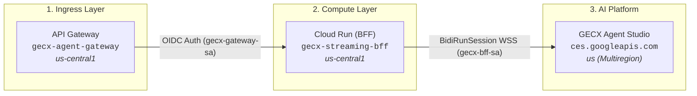
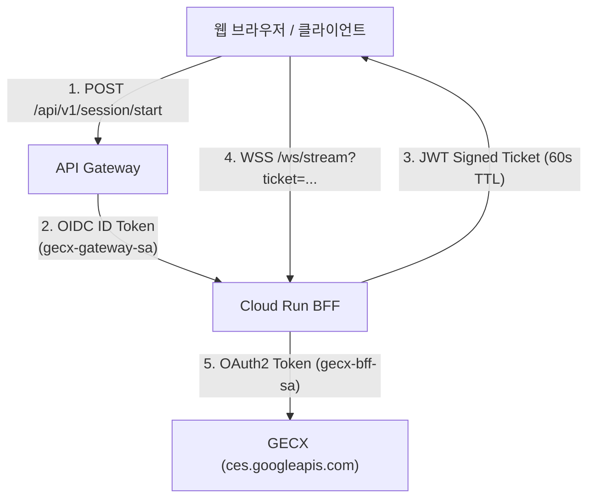

# 🗺️ GECX 실시간 음성 스트리밍 시스템 - 전체 리소스 총괄 맵 (Resource Map)

본 문서는 **GECX Real-Time Voice Streaming** 시스템의 클라우드 인프라, API 엔드포인트, IAM 보안 계정, 소스 코드 구조, 테스트 데이터셋 및 운영 도구를 한눈에 파악할 수 있도록 정리한 단일 뷰(Single-Pane-of-Glass) 리소스 총괄 맵입니다.

---

## 🏗️ 1. Google Cloud 라이브 인프라 리소스



### 1.1. 클라우드 서비스 명세
| 리소스 분류 | 리소스 이름 | 리전 / 위치 | 라이브 주소 / 엔드포인트 | 상세 사양 및 역할 |
| :--- | :--- | :---: | :--- | :--- |
| **🌐 API Gateway** | `gecx-agent-gateway` | `us-central1` | `https://gecx-agent-gateway-47lgs0mq.uc.gateway.dev` | 퍼블릭 Ingress, CORS 제어, OIDC 백엔드 인증 토큰 주입 |
| **⚡ Cloud Run BFF** | `gecx-streaming-bff` | `us-central1` | `https://gecx-streaming-bff-cwljmdzpfa-uc.a.run.app` | 2 vCPU, 2GiB, Concurrency 80, FastAPI + Uvicorn + Web SPA 서빙 |
| **🤖 GECX App** | `83281339-6a20-482e-8064-4cf96c678d76` | `us` | `projects/gemeni-workshop/locations/us/apps/83281339-6a20-482e-8064-4cf96c678d76` | CX Agent Studio 실시간 양방향 음성 추론 엔진 (`BidiRunSession`) |
| **📦 Container Image**| `gecx-streaming-bff:latest` | `gcr.io` | `gcr.io/gemeni-workshop/gecx-streaming-bff:latest` | Multi-stage 경량화 이미지 (Node.js 20 빌더 + Python 3.11 런타임) |
| **🏢 GCP Project** | `gemeni-workshop` | Global | Project Number: `329992103474` | 전체 리소스 호스팅 프로젝트 |

---

## 🔐 2. IAM 서비스 계정 및 보안 체계



| 서비스 계정 | 이메일 주소 | 부여된 IAM 역할 | 용도 및 권한 범위 |
| :--- | :--- | :--- | :--- |
| **게이트웨이 호출자** | `gecx-gateway-sa@gemeni-workshop.iam.gserviceaccount.com` | `roles/run.invoker` | API Gateway가 비공개 Cloud Run을 안전하게 호출하기 위한 OIDC 인증자 |
| **BFF 백엔드 실행자** | `gecx-bff-sa@gemeni-workshop.iam.gserviceaccount.com` | • `roles/dialogflow.admin`<br>• `roles/discoveryengine.admin`<br>• `roles/logging.logWriter` | Cloud Run BFF가 `ces.googleapis.com`의 `BidiRunSession` 스트림을 연결하고 Cloud Logging에 감사 로그를 기록하기 위한 주체 |

---

## 📡 3. API 엔드포인트 규격 (API Endpoints)

### 3.1. 제어 플레인 (Control Plane - REST)
* **URL**: `POST https://gecx-agent-gateway-47lgs0mq.uc.gateway.dev/api/v1/session/start`
* **요청 (JSON)**:
  ```json
  { "client_id": "web-cockpit-user" }
  ```
* **응답 (JSON)**:
  ```json
  {
    "session_id": "sess-ab615e06-2264-4cd1-811f-4ad789eaf790",
    "session_ticket": "eyJhbGciOiJIUzI1NiIsInR5cCI6IkpXVCJ9...",
    "ws_endpoint": "/ws/stream",
    "ticket_ttl_seconds": 60,
    "app_resource_path": "projects/gemeni-workshop/locations/us/apps/83281339-6a20-482e-8064-4cf96c678d76",
    "audio_config": {
      "encoding": "LINEAR16",
      "sample_rate_hertz": 16000,
      "chunk_duration_ms": 50
    }
  }
  ```

### 3.2. 데이터 플레인 (Data Plane - WebSocket)
* **URL**: `wss://gecx-streaming-bff-cwljmdzpfa-uc.a.run.app/ws/stream?ticket=<JWT_TICKET>`
* **클라이언트 오디오 전송 (50ms 주기 / 20Hz)**:
  ```json
  {
    "realtimeInput": {
      "audio": "<Base64_Encoded_1600Bytes_LINEAR16_PCM>"
    }
  }
  ```
* **서버 실시간 응답 수신**:
  ```json
  {
    "sessionOutput": {
      "audio": "<Base64_Encoded_Agent_Voice>",
      "text": "안녕하세요! 무엇을 도와드릴까요?"
    },
    "recognitionResult": {
      "transcript": "사용자 실시간 발화 텍스트"
    }
  }
  ```

---

## 🎧 4. 10개 시나리오 5분 테스트 음성 데이터셋 (`tests/audio_dataset/`)

모든 음성은 **16,000 Hz, 16-bit Mono LINEAR16 PCM (정확히 300초 / 6,000 청크, 9.16 MB)** 규격입니다.

| 번호 | 파일명 | 시나리오 주제 | 용량 | 재생 시간 |
| :---: | :--- | :--- | :---: | :---: |
| **01** | `scenario_01_weather_travel.wav` | 서울/제주도 날씨 및 3박 4일 여행 일정 문의 | 9.16 MB | 300초 (5.0분) |
| **02** | `scenario_02_appliance_billing.wav` | 가전 렌탈 정기 요금제 변경 및 자동이체 할인 문의 | 9.16 MB | 300초 (5.0분) |
| **03** | `scenario_03_purifier_as_booking.wav` | 정수기 필터 교체 점검 및 AS 기사 방문 예약 | 9.16 MB | 300초 (5.0분) |
| **04** | `scenario_04_ecommerce_return.wav` | 쇼핑몰 의류 배송 지연 확인 및 반품 접수 | 9.16 MB | 300초 (5.0분) |
| **05** | `scenario_05_flight_reservation.wav` | 국제선 항공권 일정 변경 및 좌석 지정 | 9.16 MB | 300초 (5.0분) |
| **06** | `scenario_06_card_loss_limit.wav` | 신용카드 해외 한도 상향 및 분실 도난 신고 | 9.16 MB | 300초 (5.0분) |
| **07** | `scenario_07_telecom_addon.wav` | 5G 데이터 요금제 변경 및 부가서비스 해지 | 9.16 MB | 300초 (5.0분) |
| **08** | `scenario_08_hotel_checkin.wav` | 호텔 얼리 체크인 및 조식 뷔페 예약 문의 | 9.16 MB | 300초 (5.0분) |
| **09** | `scenario_09_it_helpdesk_vpn.wav` | 사내 VPN 접속 장애 및 패스워드 재설정 요청 | 9.16 MB | 300초 (5.0분) |
| **10** | `scenario_10_hospital_appointment.wav` | 종합병원 건강검진 예약 및 진료과 주차 안내 | 9.16 MB | 300초 (5.0분) |

---

## 🛠️ 5. 자동화 운영 및 검증 스크립트 맵 (`scripts/`)

| 스크립트 파일 | 실행 명령어 | 설명 및 용도 |
| :--- | :--- | :--- |
| **환경 초기화** | `./scripts/setup_env.sh` | Python venv 및 npm 의존성 자동 설치 |
| **로컬 PoC 실행** | `./scripts/run_local.sh --mock 90` | 로컬 Mock 서버 + BFF + React 콕핏 통합 실행 |
| **Cloud Run 배포** | `./scripts/deploy_cloudrun.sh` | Multi-stage 컨테이너 빌드 및 Cloud Run 배포 |
| **API Gateway 배포** | `./scripts/deploy_gateway.sh` | OpenAPI 설정 생성 및 Regional API Gateway 배포 |
| **음성 데이터셋 생성** | `python3 scripts/generate_audio_dataset.py` | 10종의 5분 16kHz WAV 합성 음성 생성 |
| **벤치마크 러너** | `python3 scripts/run_dataset_benchmark.py <HOST> <SCENARIO> <SPEED>` | 실환경 5분 스트리밍 및 패킷 무결성 전수 검증 |
| **10분 스트레스 테스트** | `python3 scripts/stress_test_10m.py <HOST> 600` | 10분 연속 스트리밍 및 80~120s 타임아웃 진단 |
| **리소스 정리** | `./scripts/cleanup.sh` | PoC 종료 후 클라우드 과금 방지를 위한 원클릭 삭제 |

---

## 📚 6. 프로젝트 문서 및 레포지토리 링크 맵

| 문서명 | 경로 | 주요 내용 |
| :--- | :--- | :--- |
| **GitHub 저장소** | [GECX-Real-Time-Voice-Streaming](https://github.com/Jhko0404/GECX-Real-Time-Voice-Streaming) | 소스 코드, 브랜치(`main`), 커밋 이력 |
| **SDD (시스템 설계서)** | [`docs/sdd.md`](sdd.md) | 고해상도 아키텍처 다이어그램, 3계층 컴포넌트 설계, 엔드투엔드 시퀀스 |
| **TDD (기술 설계서)** | [`docs/tdd.md`](tdd.md) | 오디오 청킹 사양, JWT 서명 로직, 마이크로초 텔레메트리, RCA 진단 트리 |
| **트러블슈팅 가이드** | [`docs/troubleshooting.md`](troubleshooting.md) | 7대 난제별 근본 원인(Root Cause) 및 코드 레벨 해결책 |
| **GECX 프로토콜 명세**| [`docs/BidiRunSession.md`](BidiRunSession.md) | `ces.googleapis.com` BidiRunSession gRPC/WSS 규격 |
| **진행 이력서** | [`HISTORY.md`](../HISTORY.md) | 시간별 진행 상황 및 주요 마일스톤 완료 기록 |
| **프로젝트 메인** | [`README.md`](../README.md) | 원클릭 실행 가이드, 아키텍처 다이어그램, PoC 시연 절차 |
