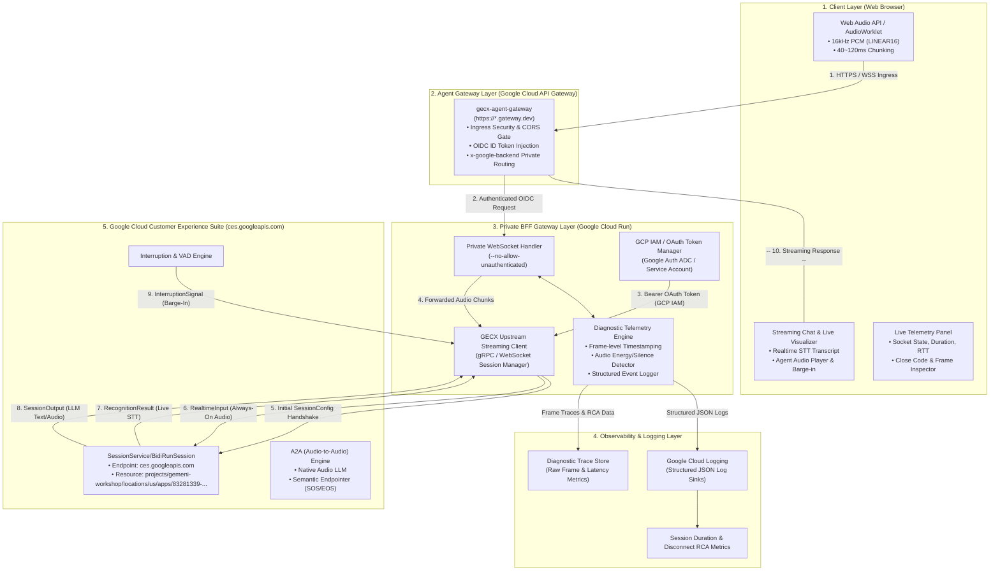
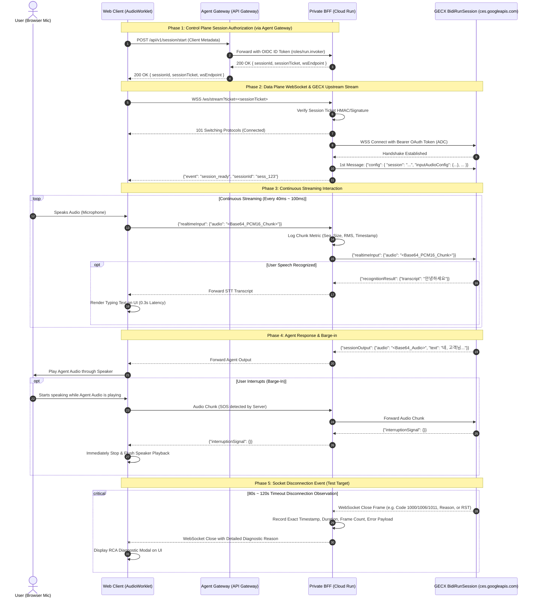
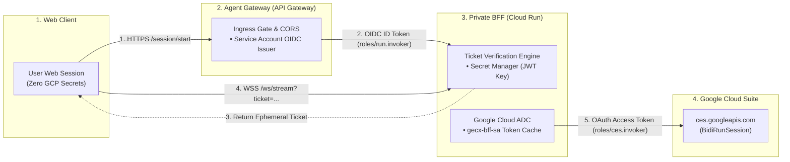
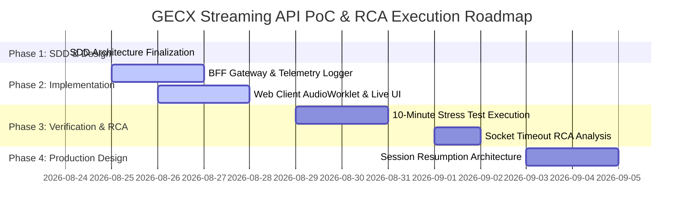

# GECX Real-Time Streaming API (BidiRunSession) PoC Solution Design Document (SDD)

## Document Control

### Document Metadata
| Field | Value |
| :--- | :--- |
| **Document Title** | GECX BidiRunSession Streaming Verification & Diagnostic Logging SDD (PoC Phase 1) |
| **Author(s)** | Junghyun Ko |
| **Date** | Aug 24, 2026 |
| **Status** | Approved Draft (PoC Technical Verification) |
| **Target Audience** | Cloud Solution Architects, AI/ML Engineers, Real-Time Audio Engineers, SRE & Telemetry Teams |
| **Reference Template** | Enterprise SDD Standard Architecture Specification (`ex_sdd.md`) |

---

## 🖼️ High-Fidelity System Architecture Diagram


> **Figure 0-1**: Google Cloud Architecture Diagram for GECX Real-Time Voice Streaming & Diagnostic Telemetry Console.
> * **Web Client**: Web Audio API (`AudioWorkletNode`), 16kHz PCM downsampling, 2열 스플릿 콕핏 UI.
> * **Control Plane**: Google Cloud API Gateway (`gecx-agent-gateway`) Ingress & OIDC ID Token 검증 (`/api/v1/session/start`).
> * **Data Plane**: Google Cloud Run (`gecx-streaming-bff`) 비공개 컨테이너, 단기 서명 티켓(JWT, 60s TTL) 기반 WSS 스트리밍, 텔레메트리 로거 & RFC 6455 Close Code 인스펙터.
> * **GECX Core**: Google Cloud CX Agent Studio (`ces.googleapis.com`), `BidiRunSession` A2A 실시간 음성 스트림 (`83281339-6a20-482e-8064-4cf96c678d76`).
> * **Observability**: Google Cloud Logging & Monitoring 통합.

---

## 0. Prerequisites, Environment Setup & Predefined Deployment Resources

### 0.1. Local & Python Environment Setup

본 솔루션의 BFF 게이트웨이 및 진단 스크립트는 격리된 파이썬 가상 환경에서 실행 및 배포됩니다.

```bash
# 1. 파이썬 가상 환경 생성 및 활성화
python3 -m venv .venv
source .venv/bin/activate

# 2. 패키지 관리자 최신화 및 필수 의존성 설치
pip install --upgrade pip
pip install -r requirements.txt
```

### 0.2. GCP Authentication & Project Context

GCP 콘솔 및 CLI 환경에서 적절한 권한을 획득하고 대상 프로젝트를 설정합니다.

```bash
# 1. GCP 사용자 및 ADC 로그인
gcloud auth login
gcloud auth application-default login

# 2. 작업 대상 프로젝트 설정
gcloud config set project gemeni-workshop

# 3. 필수 GCP API 서비스 활성화
gcloud services enable \
  ces.googleapis.com \
  apigateway.googleapis.com \
  servicemanagement.googleapis.com \
  servicecontrol.googleapis.com \
  run.googleapis.com \
  cloudbuild.googleapis.com \
  secretmanager.googleapis.com \
  logging.googleapis.com
```

---

### 0.3. Target Resource Deployment Metadata Matrix

본 PoC에서 연동 및 배포되는 모든 GCP 리소스 식별자는 아래와 같이 사전에 엄격히 정의됩니다.

| 리소스 구분 (Resource Item) | 설정 값 (Predefined Value) | 설명 및 레퍼런스 |
| :--- | :--- | :--- |
| **GCP Project ID** | `gemeni-workshop` | 워크숍 대상 기본 GCP 프로젝트 |
| **GECX App Location** | `us` | CES API 리소스 위치 (`ces.googleapis.com`) |
| **GECX App ID** | `83281339-6a20-482e-8064-4cf96c678d76` | 대상 CX Agent Studio 애플리케이션 UUID |
| **GECX Resource Full Path** | `projects/gemeni-workshop/locations/us/apps/83281339-6a20-482e-8064-4cf96c678d76` | `SessionConfig` 핸드쉐이크 시 주입되는 전체 리소스 경로 |
| **CX Agent Studio Console** | `https://ces.cloud.google.com/projects/gemeni-workshop/locations/us/apps/83281339-6a20-482e-8064-4cf96c678d76` | 에이전트 빌더 및 콘솔 확인 링크 |
| **CXAS Automation Tool** | `https://github.com/GoogleCloudPlatform/cxas-scrapi.git` | CX Agent Studio SCRAPI 자동화 스크립트 라이브러리 |
| **Reference Agent Gateway** | `https://coway-agent-gateway-7p7fk8nj.uc.gateway.dev/` | 실제 GCP 환경에 설정된 참조용 Agent Gateway |
| **Dedicated Agent Gateway** | `gecx-agent-gateway` (Region: `us-central1`) | 본 PoC를 위해 신규 생성하는 전용 Agent Gateway |
| **Cloud Run BFF Service** | `gecx-streaming-bff` (Region: `us-central1`) | 비공개(`--no-allow-unauthenticated`) 프록시 서비스 |
| **Cloud Run Ingress Policy** | `Internal & Cloud Load Balancing / API Gateway` | 보안 정책상 Public 직접 접근 전면 차단 |

---

### 0.4. Dedicated Agent Gateway & Cloud Run Private Architecture

보안 정책상 Cloud Run 서비스의 Public URL 직접 노출이 제한되므로, 실제 GCP 환경의 `https://coway-agent-gateway-7p7fk8nj.uc.gateway.dev/` 구성을 모델로 하여 **Google Cloud API Gateway 기반의 전용 Agent Gateway (`gecx-agent-gateway`)**를 프론트에 배치하며, **제어 플레인(Control Plane)과 데이터 플레인(Data Plane)을 명확히 분리**하여 운영합니다.

```text
[Browser Client]
       │
       ├─ (1) Control Plane [HTTPS REST] ──► [Agent Gateway] ──(OIDC)──► [Private Cloud Run]
       │      POST /api/v1/session/start                                 (Issue Signed Ephemeral Ticket)
       │      ◄── Returns { sessionId, sessionTicket, wsEndpoint } ──────┘
       │
       └─ (2) Data Plane [WSS Direct Stream] ──────────────────────────► [Private Cloud Run WS]
              WSS /ws/stream?ticket=<sessionTicket>                       (Validate Ticket & Stream GECX)
                                                                           │
                                                                           └──(OAuth2 Bearer)──► [ces.googleapis.com]
```

1. **제어 플레인 (Control Plane - Agent Gateway REST API)**:
   * 브라우저 클라이언트는 세션 시작 시 `POST https://<gateway-id>.uc.gateway.dev/api/v1/session/start` 엔드포인트를 호출합니다.
   * Agent Gateway는 요청을 검증하고, Gateway 전용 서비스 어카운트(`gecx-gateway-sa`)의 **OIDC ID Token**을 생성하여 비공개 Cloud Run 서비스에 안전하게 전달합니다.
   * Cloud Run은 단기 유효(TTL: 60초) 암호화 서명 티켓(`sessionTicket`)과 스트리밍 엔드포인트 URL을 발급하여 반환합니다.
2. **데이터 플레인 (Data Plane - Cloud Run WebSocket Stream)**:
   * 브라우저 클라이언트는 발급받은 `sessionTicket`을 쿼리 파라미터로 첨부하여 `wss://<cloud-run-url>/ws/stream?ticket=<sessionTicket>`으로 직접 보안 소켓을 수립합니다.
   * Cloud Run BFF는 서명 티켓을 검증하고, 유효한 세션에 한해 Google Cloud CX Suite(`ces.googleapis.com`)의 `BidiRunSession`과 양방향 스트리밍 파이프를 개설합니다.
3. **CORS 및 보안 헤더 중앙 관리**:
   * 브라우저 웹 클라이언트와의 CORS Preflight (`OPTIONS`) 요청 및 보안 헤더를 Gateway 레이어에서 일괄 처리합니다.

---

### 0.5. Service Account & IAM Role Matrix

| 서비스 계정 (Service Account) | 대상 리소스 | 부여 역할 (IAM Role) | 용도 및 권한 |
| :--- | :--- | :--- | :--- |
| **`gecx-gateway-sa`**<br>`gecx-gateway-sa@gemeni-workshop.iam.gserviceaccount.com` | Cloud Run (`gecx-streaming-bff`) | `roles/run.invoker` | API Gateway가 비공개 Cloud Run 서비스를 호출할 수 있는 권한 |
| **`gecx-bff-sa`**<br>`gecx-bff-sa@gemeni-workshop.iam.gserviceaccount.com` | GECX (`ces.googleapis.com`) | `roles/ces.invoker`<br>`roles/ces.admin` | BFF 컨테이너가 `BidiRunSession` 스트리밍 API를 양방향 호출할 수 있는 권한 |
| | Cloud Logging | `roles/logging.logWriter` | 세션 프레임 및 RCA 진단 로그를 Cloud Logging에 기록할 수 있는 권한 |
| **Cloud Build Service Agent** | Artifact Registry / Cloud Run | `roles/run.admin`<br>`roles/iam.serviceAccountUser` | 컨테이너 자동 빌드 및 Cloud Run 자동 배포 권한 |

---

### 0.6. Environment Variables Configuration (`.env.example`)

| 환경 변수 (Env Variable) | 필수 여부 | 기본값 / 설정 예시 | 설명 |
| :--- | :---: | :--- | :--- |
| **`PROJECT_ID`** | **필수** | `gemeni-workshop` | Google Cloud 프로젝트 ID |
| **`LOCATION`** | **필수** | `us` | GECX CES API 리소스 위치 (`ces.googleapis.com`) |
| **`APP_ID`** | **필수** | `83281339-6a20-482e-8064-4cf96c678d76` | CX Agent Studio 애플리케이션 식별자 |
| **`DEPLOYMENT_ID`** | 선택 | `default` | 에이전트 배포 식별자 (미지정 시 default) |
| **`REGION`** | 선택 | `us-central1` | Cloud Run 및 API Gateway 배포 리전 |
| **`SERVICE_NAME`** | 선택 | `gecx-streaming-bff` | Cloud Run 비공개 백엔드 서비스명 |
| **`GATEWAY_ID`** | 선택 | `gecx-agent-gateway` | Google Cloud API Gateway 리소스명 |
| **`TICKET_SECRET_KEY`** | **필수** | `(32바이트 이상 임의 문자열)` | WebSocket 단기 서명 티켓(JWT/HMAC) 서명 키 |
| **`LOG_LEVEL`** | 선택 | `DEBUG` | 상세 진단 로그 레벨 (`DEBUG`, `INFO`, `WARNING`) |

---

## 1. Executive Summary & Scope Boundaries

### 1.1. Business & Technical Context

#### 1) Problem Statement & Background
* **GECX Streaming API 단절 이슈**: Google Cloud Customer Experience Suite(GECX)의 실시간 멀티모달 양방향 스트리밍 API인 `BidiRunSession`(`ces.googleapis.com`)을 활용하여 장시간 음성 대화를 시도할 때, **80초 ~ 120초(약 2분 이내) 구간에서 소켓 세션이 예기치 않게 종료/단절되는 현상**이 사전 테스트에서 관측되었습니다.
* **실시간 상호작용 체감 성능 확보 필요**: 현업 컨택센터 및 상담 어시스턴트 환경에서는 빠른 실시간 STT(0.3~0.5초) 표출과 저지연 대화 피드백을 요구하나, 백엔드 LLM 추론 시간(1~2초)과의 간극이 존재합니다.
* **PoC의 핵심 철학 (기술 검증 및 원인 분석 우선)**: 성급한 자동 재연결(Reconnection Handler)이나 세션 롤오버 등의 방어 로직을 사전에 임의 구현하기에 앞서, **실제로 10분 이상 장시간 스트리밍 시 소켓 세션이 정확히 어느 시점에, 어떤 에러 코드와 네트워크 상태로 단절되는지 실증적으로 검증하고 원인을 정밀 분석(RCA: Root Cause Analysis)하기 위한 고도화된 로깅/진단 인프라 구축**이 최우선 과제입니다.

#### 2) PoC Primary Goals
* **BidiRunSession End-to-End 스트리밍 검증**: Web Audio API(브라우저 마이크) $\rightarrow$ BFF Gateway $\rightarrow$ GECX `BidiRunSession` gRPC/WebSocket 파이프라인의 실시간 오디오/텍스트 양방향 통신 검증.
* **초정밀 진단 및 세션 텔레메트리 체계 구축**: 소켓 핸드쉐이크부터 프레임 송수신, 청크 전송 주기, VAD 무음 구간, 소켓 Close Code/Reason, GCP 에러 페이로드, 지연시간(RTT, TTFT, STT Latency)을 마이크로초 단위로 추적하는 구조화된 로그 파이프라인 확보.
* **타임아웃 및 세션 단절 원인(RCA) 규명**: 10분 연속 스트리밍 부하 테스트를 통해 80~120초 단절의 원인 가설(Quota 초과, VAD 무음 타임아웃, GCP Load Balancer Idle Timeout, gRPC KeepAlive 누락 등)을 체계적으로 검증.
* **차기 프로덕션 복구 아키텍처 토대 마련**: PoC 분석 결과를 기반으로 세션 복구(Session Resumption, 최장 15분), 링 버퍼(Ring Buffer) 재전송 및 무중단 롤오버 메커니즘 설계를 위한 명확한 기준치 확립.

---

### 1.2. Scope Boundaries

#### 1) In-Scope for PoC Phase 1
* **BFF (Backend-for-Frontend) 프록시 게이트웨이**:
  * Cloud Run 기반의 WebSocket 프록시 서비스 (FastAPI / Node.js).
  * GCP OAuth 2.0 Access Token 관리 및 `ces.googleapis.com`과의 안전한 업스트림 세션 수립.
  * 브라우저 $\leftrightarrow$ BFF $\leftrightarrow$ GECX 간 실시간 오디오/텍스트 양방향 중계.
* **웹 기반 실시간 인터랙션 & 진단 UI**:
  * Web Audio API / AudioWorklet 기반 16kHz PCM (LINEAR16) 마이크 캡처 및 40~120ms 청킹 전송.
  * 실시간 스트리밍 텍스트 표출 (STT `recognitionResult` 및 에이전트 `sessionOutput`).
  * 사용자 끼어들기(Barge-In, `interruptionSignal`) 수신 시 오디오 재생 즉시 중단.
  * 실시간 세션 상태 모니터 대시보드 (연결 유지 시간, 실시간 송수신 바이트, 핑/퐁 RTT, 단절 이벤트 로그 뷰어).
* **상세 진단 로깅 및 텔레메트리 (Diagnostic Logging Layer)**:
  * 클라이언트 및 서버 양단의 구조화된 JSON 이벤트 로깅.
  * WebSocket 프레임 수준의 타임스탬프, 페이로드 크기, 패킷 카운트, 침묵(Silence) 감지 여부 기록.
  * 소켓 단절 시점의 RFC 6455 Close Code, Close Reason, gRPC Status, Cloud Run Proxy 로그 정합.
* **10분 스트리밍 부하 테스트 및 RCA 프로토콜**:
  * 지속적인 오디오 스트리밍(Always-On) 테스트 시나리오 및 단절 시점 정밀 모니터링.

#### 2) Out of Scope for PoC Phase 1
* **자동 재연결 및 장애 극복(Failover) 로직**: 단절 원인 분석이 완료되기 전의 임의 재연결 로직은 의도적으로 제외 (원인 규명이 우선).
* **복잡한 백엔드 도구 연동**: CRM, Ticketing, 외부 RAG 시스템과의 Tool Call 연동은 제외하고 순수 대화 스트리밍에 집중.
* **다국어 및 음성 합성 커스텀 음색 튜닝**: 기본 지원 언어(한국어/영어) 및 기본 A2A 모델 설정 사용.
* **상용 결제/인증 연동**: Firebase Auth 및 SSO 연동은 제외하고 개발자 테스트 토큰 또는 서비스 어카운트 활용.

---

## 2. Target Architecture Overview

### 2.1. End-to-End System Architecture


본 솔루션은 클라이언트 브라우저, **Google Cloud API Gateway 기반 전용 Agent Gateway (`gecx-agent-gateway`)**, **비공개 Cloud Run 기반의 Backend-for-Frontend(BFF) Gateway**, 그리고 **Google Cloud CX Suite(`ces.googleapis.com`) BidiRunSession** 백엔드로 구성됩니다.



---

### 2.2. Component Responsibilities

| Tier | Component | Key Responsibilities |
| :--- | :--- | :--- |
| **Client Layer** | `AudioWorklet Capture` | 마이크 입력을 16,000Hz, 16-bit Mono PCM 포맷으로 캡처하고 40ms~100ms 버퍼 크기로 패킷화하여 전송. |
| | `Streaming Chat UI` | 수신되는 STT 텍스트(`recognitionResult`)와 모델 답변(`sessionOutput`)을 0.1초 단위로 지연 없이 렌더링. |
| | `Barge-In Controller` | `interruptionSignal` 감지 시 즉시 브라우저 Web Audio API의 출력 버퍼를 비우고 재생을 중단(Flush). |
| | `Telemetry Panel` | 현재 세션 연결 시간(초), 전송된 프레임 수, 평균 지연시간, 소켓 상태 및 에러 코드를 실시간 표출. |
| **Agent Gateway Layer** | `gecx-agent-gateway` | `https://*.gateway.dev` Public Ingress 진입점 제공, CORS Preflight 처리, Private Cloud Run 연동을 위한 OIDC ID Token 발급 및 보안 프록시. |
| **BFF Gateway (Cloud Run)** | `Auth Manager` | GCP Service Account / ADC를 통해 `https://www.googleapis.com/auth/cloud-platform` 스코프의 유효한 OAuth Access Token을 획득/갱신. |
| | `GECX Streaming Client` | `wss://ces.googleapis.com/ws/...` 연결 수립, 최초 `SessionConfig` 핸드쉐이크 메시지 주입, 양방향 프레임 중계. |
| | `Diagnostic Telemetry Engine` | 모든 Ingress/Egress 프레임의 타임스탬프, 페이로드 크기, 오디오 음압(RMS), 소켓 에러/종료 이벤트를 정밀 기록. |
| **GECX Suite** | `BidiRunSession` | A2A 기반 실시간 멀티모달 추론, Semantic VAD(SOS/EOS 감지), 음성 합성 및 턴 완료(Turn Completion) 처리 (`gemeni-workshop` 프로젝트 연동). |
| **Observability** | `Cloud Logging / JSON Sink` | 80~120초 단절 시점의 Close Code, TCP 연결 상태, GCP API 응답 코드를 집계하여 RCA 분석에 제공. |

---

## 3. Network, Protocol & Data Flow Specifications

### 3.1. Upstream & Downstream Endpoints

* **BFF Upstream Target (GECX)**:
  * Protocol: WebSocket (WSS) or gRPC Bi-directional Stream
  * URL: `wss://ces.googleapis.com/ws/google.cloud.ces.v1.SessionService/BidiRunSession/locations/{location}`
  * Default Location: `us-central1` 또는 `us-east1`
  * Headers:
    ```http
    Authorization: Bearer <GCP_OAUTH_ACCESS_TOKEN>
    Content-Type: application/json
    ```
* **Client $\leftrightarrow$ BFF Endpoint**:
  * Protocol: WebSocket (`ws://localhost:8000/ws/stream` or `wss://<cloud-run-url>/ws/stream`)
  * Data Encoding: JSON Encapsulated Audio / Binary Frames

---

### 3.2. Session Lifecycle & Message Schema



#### 1) Initial Handshake Config Schema (`Client -> GECX via BFF`)
연결 수립 직후 전송되는 최초 필수 메시지입니다.
```json
{
  "config": {
    "session": "projects/{project_id}/locations/{location}/apps/{app_id}/sessions/{session_id}",
    "inputAudioConfig": {
      "audioEncoding": "LINEAR16",
      "sampleRateHertz": 16000,
      "enableEchoCancellation": true
    },
    "outputAudioConfig": {
      "audioEncoding": "LINEAR16",
      "sampleRateHertz": 16000
    },
    "deployment": "projects/{project_id}/locations/{location}/apps/{app_id}/deployments/{deployment_id}"
  }
}
```

#### 2) Realtime Audio Input Schema (`Client -> BFF -> GECX`)
마이크에서 캡처된 40ms~120ms 단위의 오디오 청크를 전송합니다. 무음(Silence) 상태에서도 끊김 없이 지속 전송합니다.
```json
{
  "realtimeInput": {
    "audio": "UklGRuD6AABXQVZFZm10IBAAAAABAAEAQB8AAIA+AAACABAA..."
  }
}
```

#### 3) Server Response Schema (`GECX -> BFF -> Client`)
```json
{
  "recognitionResult": {
    "transcript": "오늘 서울 날씨 어때?",
    "isFinal": false
  },
  "sessionOutput": {
    "text": "오늘 서울의 날씨는 맑으며, 최고 기온은 28도입니다.",
    "audio": "//uQZAAAAAAAAAAAAAAAAAAAAAAAAAAAAAAAAAAAAAAAAAA...",
    "turnCompleted": true
  },
  "interruptionSignal": {},
  "endSession": {}
}
```

---

## 4. Comprehensive Telemetry & Logging Architecture

80~120초 소켓 단절 원인을 실증적으로 규명하기 위해 **4단계 정밀 진단 텔레메트리 파이프라인**을 설계합니다.

```mermaid
flowchart LR
    subgraph Sources["1. Telemetry Sources"]
        ClientTelemetry["Client AudioWorklet & WS Events"]
        BFFTelemetry["BFF Frame Tracing & Proxy Events"]
        UpstreamEvents["GECX Upstream Frame & Status"]
    end

    subgraph Collector["2. Diagnostic Collector (BFF Engine)"]
        TimeSync["Precision Nanosecond Timestamp Sync"]
        MetricsAggregator["Chunk/Bitrate/RMS Aggregator"]
        CloseInspector["RFC 6455 & gRPC Code Inspector"]
    end

    subgraph LogSinks["3. Storage & Visualization"]
        JSONSink[("Structured JSON Diagnostic Log")]
        UIPanel["Client Live Telemetry Inspector"]
        RCAReport["RCA Incident Report Generator"]
    end

    Sources --> Collector
    Collector --> LogSinks
```



### 4.1. Structured Diagnostic JSON Schema

BFF Gateway 및 클라이언트는 모든 세션 라이프사이클 이벤트에 대해 아래의 표준 JSON 포맷으로 구조화된 로그를 생성합니다.

```json
{
  "trace_id": "tr-9a8b7c6d-5e4f-3a2b",
  "session_id": "sess-gecx-poc-001",
  "timestamp": "2026-08-24T08:45:12.345678Z",
  "epoch_ms": 1787561112345,
  "elapsed_session_sec": 94.215,
  "event_type": "SOCKET_DISCONNECTED",
  "source_layer": "BFF_UPSTREAM_GECX",
  "payload_metrics": {
    "total_audio_chunks_sent": 1884,
    "total_bytes_sent": 3014400,
    "total_chunks_received": 142,
    "total_bytes_received": 912000,
    "average_chunk_interval_ms": 50.02,
    "last_chunk_sent_before_ms": 12,
    "last_silence_duration_sec": 14.5,
    "mean_audio_rms_db": -42.8
  },
  "socket_close_info": {
    "raw_close_code": 1006,
    "close_code_name": "CLOSE_ABNORMAL",
    "close_reason": "Connection closed by remote peer without close frame",
    "grpc_status_code": "DEADLINE_EXCEEDED",
    "http_status": 200,
    "gcp_error_details": {
      "error_code": "RESOURCE_EXHAUSTED",
      "message": "Quota exceeded or streaming duration limit reached",
      "domain": "ces.googleapis.com"
    }
  },
  "network_diagnostics": {
    "client_ip": "10.0.1.42",
    "bff_instance_id": "cloudrun-bff-001-abcde",
    "round_trip_latency_ms": 28.4,
    "ping_pong_failures": 0
  }
}
```

### 4.2. Key Metrics Tracked per Millisecond

1. **Session Timing Metrics**:
   * `session_start_time`, `session_current_duration_ms`, `time_to_first_stt_ms`, `time_to_first_audio_ms`.
2. **Audio Stream Integrity**:
   * `chunk_sequence_id`, `chunk_size_bytes`, `chunk_duration_ms` (보통 50ms), `silence_ratio` (무음 비율).
3. **Transport & Socket Health**:
   * `ws_ping_latency_ms`, `client_buffer_amount`, `tcp_retransmissions`, `ws_close_code`, `ws_close_reason`.
4. **GECX Inference Telemetry**:
   * `stt_turn_id`, `stt_confidence`, `barge_in_count`, `interruption_latency_ms`.

---

## 5. Disconnection Root Cause Analysis (RCA) Framework

### 5.1. RCA Hypothesis Testing Matrix

사전 테스트에서 발생한 **80초 ~ 120초 구간의 소켓 세션 단절**에 대해 다음 5대 가설을 수립하고 실증 검증을 수행합니다.

| 가설 ID | 원인 가설 (Hypothesis) | 메커니즘 및 징후 | 진단 및 검증 방법 | 확인 지표 및 판별 기준 |
| :--- | :--- | :--- | :--- | :--- |
| **HYP-01** | **GCP Quota / TPM 제한 초과** | 분당 토큰 용량(TPM) 또는 BidiRunSession 분당 스트리밍 시간 Quota 초과로 인한 강제 종료 | Cloud Quotas 모니터링 및 `RESOURCE_EXHAUSTED` 에러 페이로드 검출 | GCP Error Response에 `429 Too Many Requests` 또는 `RESOURCE_EXHAUSTED` 수신 여부 |
| **HYP-02** | **VAD Silence / Inactivity Timeout** | 사용자가 말을 하지 않는 무음 상태가 일정 시간(예: 30초~60초) 지속되어 백엔드가 세션을 유휴 상태로 간주하고 종료 | 마이크 무음(Silence PCM) 전송 vs 실제 발화 음성 전송 시 단절 시간 비교 | 지속 발화 상태에서도 80~120초에 끊기는지, 무음 상태에서만 끊기는지 분리 측정 |
| **HYP-03** | **Cloud Run / HTTP Proxy Idle Timeout** | Cloud Run의 기본 요청 타임아웃(300초 기본, 설정에 따라 60~120초) 또는 프록시 계층의 TCP 유휴 연결 정리 | WebSocket Ping/Pong 프레임 주기(10초 단위) 전송 여부 및 Cloud Run Container 로그 정합 | Cloud Run 인프라 단의 `504 Gateway Timeout` 또는 프록시 레벨 RST 패킷 검출 |
| **HYP-04** | **BidiRunSession Single Stream Max Duration Limit** | GECX 스트리밍 API 백엔드 자체에 단일 소켓 연결당 최대 수명(예: 120초) 하드 리밋이 존재하고, Session Resumption을 유도하는 정책 | 정확히 120.00초에 일관되게 단절되는지 타임스탬프 분석 | 발화 여부, 네트워크 상태와 무관하게 특정 고정 초(예: 120초)에서 `GOAWAY` 또는 정규 종료 코드 수신 |
| **HYP-05** | **gRPC / OAuth Token Expiry or KeepAlive 누락** | gRPC KeepAlive 프로브 누락으로 인한 방화벽/LB 세션 드롭, 또는 OAuth Access Token 만료 처리 이슈 | OAuth 만료 시간(기본 3600초) 확인 및 TCP KeepAlive / WS Ping 프레임 로깅 | KeepAlive 추가 후 세션 유지 시간이 연장되는지 대조군/실험군 테스트 |

---

### 5.2. 10-Minute Continuous Stress Test Protocol

1. **테스트 환경 설정**:
   * Cloud Run BFF 컨테이너 배포 (Timeout = 3600s, Max Concurrency = 80).
   * WebSocket Ping Interval: 10초, Pong Timeout: 5초.
2. **시나리오 A: 지속 발화 테스트 (Active Continuous Speech)**
   * 10분 길이의 오디오 파일(뉴스 낭독 음원 등)을 마이크 입력 스트림으로 연속 주입.
   * 80~120초 구간 통과 여부 및 단절 시점 정밀 로깅.
3. **시나리오 B: 지속 무음 테스트 (Continuous Silence with Always-On Chunks)**
   * 10분간 완전 무음(Noise Floor -60dB 이하) PCM 청크를 50ms 주기로 끊임없이 주입.
   * VAD Inactivity Timeout 발생 시점 측정.
4. **시나리오 C: 대화형 인터랙션 테스트 (Turn-by-turn with Barge-In)**
   * 30초 간격으로 질의 $\leftrightarrow$ 답변 반복, 중간에 끼어들기(Barge-in) 3회 수행.
   * 세션 유지 시간 및 총 토큰 소모량 측정.

---

## 6. Security, Authentication & Governance

### 6.1. Authentication & Security Architecture



* **Zero-Credential Exposure to Browser**: 브라우저 클라이언트에는 GCP 서비스 어카운트 키나 마스터 OAuth 토큰을 절대 노출하지 않습니다. 브라우저는 Agent Gateway로부터 발급받은 단기 서명 티켓(60초 TTL)만으로 Cloud Run WebSocket에 접근합니다.
* **Service Account Chain & Least Privilege (최소 권한 원칙)**:
  * `gecx-gateway-sa`: 오직 Cloud Run 호출 권한(`roles/run.invoker`)만 보유.
  * `gecx-bff-sa`: 오직 GECX 스트리밍 호출 권한(`roles/ces.invoker`) 및 로그 작성 권한(`roles/logging.logWriter`)만 보유.
* **BFF Token Lifecycle Management**: BFF는 GCP Application Default Credentials(ADC)를 사용하여 `ces.googleapis.com`에 접근하며, 토큰 만료 5분 전에 백그라운드에서 비동기 갱신합니다.
* **Audio & STT Data Privacy**: PoC 환경에서는 원인 분석을 위한 메트릭 및 오디오 RMS, 지속 시간만 영구 기록하며, 음성 원본 바이너리는 진단 완료 후 메모리에서 즉시 폐기합니다.

---

## 7. UI Design & Frontend Architecture (`Leonxlnx/taste-skill` Standard)

### 7.1. Design Read & Core Philosophy

본 웹 클라이언트는 **`Leonxlnx/taste-skill` (Anti-Slop Frontend Skill)** 가이드를 준수하여, 흔히 생성되는 generic AI 템플릿(보라색 그라데이션, 중앙 정렬 히어로, 떠다니는 글래스모피즘 카드)을 엄격히 배제하고 **Linear 스타일의 정밀 다크 테크(Dark Tech) & DevTool 엔지니어링 콘솔** 미학으로 설계됩니다.

> **Design Read Statement**:
> *"Reading this as: Real-Time AI Audio Streaming & SRE Diagnostic Console for Technical Engineers, with a Linear-style Dark Tech Minimalist visual language, leaning toward Tailwind CSS + Geist Sans/Mono + restrained micro-motion and high-density telemetry."*

### 7.2. The Three Dials (Core Configuration)

* **`DESIGN_VARIANCE: 6`**: 정밀 엔지니어링 도구에 최적화된 2열 비대칭 콕핏 구조 (좌측: 음성/대화 상호작용 45%, 우측: 실시간 텔레메트리 55%).
* **`MOTION_INTENSITY: 6`**: 물리 기반의 절제된 마이크로 모션 (오디오 파형 오실로스코프 반응형 스케일링, 실시간 타이핑 청크 렌더링, Barge-in 시 즉각적인 앰버/로즈 플래시 피드백). 불필요한 무한 회전 애니메이션 전면 금지.
* **`VISUAL_DENSITY: 6`**: 초정밀 진단에 적합한 데이터 밀도 (모노스페이스 타임스탬프, 1px 정밀 보더, 패킷 스트림 인스펙터 및 상태 배지 집약).

### 7.3. Anti-Default Design System & Tokens

| 구분 | 금지 패턴 (Banned Defaults) | 적용 디자인 시스템 (Applied Taste-Skill Choices) |
| :--- | :--- | :--- |
| **컬러 팔레트** | AI 보라색 그라데이션, generic indigo/slate-900 | **Deep Zinc Monochrome & Functional Accents**<br>• Background Canvas: `#09090b` (zinc-950)<br>• Surface Cards: `#121215` / `#18181b` (zinc-900)<br>• Sub-borders: `#27272a` (zinc-800, 1px crisp border)<br>• Status Accents: Emerald (`#10b981`, Active), Amber (`#f59e0b`, Barge-In), Rose (`#f43f5e`, Disconnect) |
| **타이포그래피** | Inter 단독 사용, 6줄 이상 긴 텍스트 줄바꿈 | **Dual Typography Hierarchy**<br>• Headings / Body: `Geist Sans` (Wide track, tight leading)<br>• Telemetry & Logs: `Geist Mono` / `JetBrains Mono` (완전 고정폭) |
| **레이아웃** | 중앙 정렬 3열 카드, 떠다니는 모달 | **2열 스플릿 콕핏 레이아웃 (2-Column Split View)**<br>• 좌측: 실시간 음성 스트림 & 오디오 파형 캔버스<br>• 우측: 실시간 소켓 프레임 인스펙터 & 지연시간 그래프 |
| **인터랙션** | 느린 페이드인, 무의미한 펄스 효과 | 하드웨어 가속 Canvas 2D 오디오 비주얼라이저, 밀리초 단위 세션 타이머, 키보드 핫키(Spacebar 발화 토글) |

---

### 7.4. 2-Column Split Cockpit Layout Specification

```text
+---------------------------------------------------------------------------------------------------------+
| [Header] GECX Streaming API Console  | Session: sess_9876 | Status: [LIVE 16kHz] | Duration: 01:42.840  |
+----------------------------------------------------+----------------------------------------------------+
| [LEFT COLUMN: Conversational & Audio Stream (45%)] | [RIGHT COLUMN: Realtime Telemetry & Inspector(55%)]|
|                                                    |                                                    |
| 1. Live Audio Oscilloscope Canvas (120px)          | 1. Metric Summary Strip                            |
|    ~~~~~~~~~~~~~~~~/\/\/\~~~~~~~~~~~~~~~~~         |    [RTT: 24ms] [Rate: 20 chunks/s] [RMS: -38dB]    |
|    State: [LISTENING] (Always-On Active)           |                                                    |
|                                                    | 2. Ping-Pong RTT & Jitter Timeline (Sparkline)     |
| 2. Transcript & Streaming Dialogue View            |    ---------------------------------------- 28ms   |
|    [User STT (0.3s)]: "오늘 서울 날씨 어때?"       |                                                    |
|    [Agent LLM]: "오늘 서울의 날씨는 맑으며..."     | 3. Live WebSocket Frame Stream (Filter: All/Audio/STT)
|    [Barge-In Flash]: User speaking -> Audio Muted  |    12:04:12.102 | TX | AudioChunk #142 | 3.2KB     |
|                                                    |    12:04:12.152 | TX | AudioChunk #143 | 3.2KB     |
| 3. Primary Control Deck                            |    12:04:12.180 | RX | STT_Chunk: "오늘" | 0.3s RTT  |
|    [  (●) MIC STREAMING (SPACEBAR)  ] [ END SESSION ]|                                                    |
|                                                    | 4. Disconnect RCA Inspector & Close Code Analysis  |
|                                                    |    Code: 1006 | Reason: Peer Reset | Export JSON   |
+----------------------------------------------------+----------------------------------------------------+
```

---

### 7.5. Technology Stack & Directory Structure

#### 1) Technology Stack
* **Frontend**: React 18, Vite, TypeScript, Tailwind CSS v4, Lucide React, Geist Font Family, Web Audio API (`AudioWorkletNode`).
* **Backend (BFF Gateway)**: Python 3.11+ (FastAPI, WebSockets, `structlog`, `google-auth`) 또는 Node.js 20+ (Fastify / `ws`).
* **Runtime**: Google Cloud Run (Containerized Dockerfile).

#### 2) Project Directory Structure
```text
02.gecx-streaming-api/
├── docs/                         # 시스템 및 기술 설계 문서
│   ├── sdd.md                    # 본 시스템 설계 문서 (SDD, taste-skill & Gateway 통합)
│   ├── tdd.md                    # 기술 상세 설계 문서 (TDD)
│   ├── meeting_note.md           # 요구사항 및 이슈 정의서
│   ├── BidiRunSession.md         # GECX 공식 API 레퍼런스 및 사양
│   └── ex_sdd.md                 # 엔터프라이즈 SDD 레퍼런스 템플릿
├── Dockerfile                    # Cloud Run 배포용 Dockerfile
├── requirements.txt              # Backend 패키지 의존성 (FastAPI, websockets, structlog 등)
├── .env.example                  # 환경 변수 템플릿
├── CLAUDE.md                     # 프로젝트 개발 지침서
├── README.md                     # 프로젝트 아키텍처 개요
├── api_gateway/                  # Google Cloud API Gateway 설정
│   ├── openapi_gateway.yaml      # x-google-backend가 정의된 Gateway OpenAPI 3.0 명세
│   └── gateway_config.json       # Gateway 배포 메타데이터
├── bff/                          # Backend-for-Frontend Gateway 소스
│   ├── main.py                   # FastAPI WebSocket 진입점 & 프록시 라우터
│   ├── auth.py                   # 세션 서명 토큰(JWT) 발급/검증
│   ├── gecx_client.py            # ces.googleapis.com BidiRunSession 스트리밍 클라이언트
│   ├── telemetry.py              # 프레임 레벨 로거, 지연시간/RMS 측정 모듈
│   └── config.py                 # GCP Project/Location/App 환경설정 (gemeni-workshop)
├── web/                          # React Frontend 클라이언트 (taste-skill Standard)
│   ├── package.json              # 프론트엔드 의존성 (@fontsource/geist-sans, lucide-react 등)
│   ├── vite.config.ts            # Vite 빌드 설정
│   ├── tailwind.config.ts        # Linear-style Dark Tech 테마 토큰 설정
│   ├── index.html                # HTML 템플릿
│   ├── src/
│   │   ├── App.tsx               # 2열 스플릿 콕핏 메인 레이아웃
│   │   ├── index.css             # Geist 폰트, Tailwind 베이스, 커스텀 스크롤바
│   │   ├── audio/
│   │   │   ├── audio_recorder.ts # AudioWorklet 기반 PCM 16kHz 청킹 캡처
│   │   │   ├── pcm_worklet.js    # 16kHz 다운샘플링 & LINEAR16 변환 Worklet
│   │   │   └── audio_player.ts   # 수신 오디오 버퍼 재생 및 Barge-in Flush
│   │   ├── services/
│   │   │   └── websocket.ts      # WebSocket 통신 서비스
│   │   └── components/
│   │       ├── Header.tsx        # 세션 정보, Live 상태 배지, 타이머
│   │       ├── Visualizer.tsx    # Canvas 2D 실시간 오실로스코프 파형
│   │       ├── ChatWindow.tsx    # 타이핑 스트리밍 STT/LLM 대화창
│   │       ├── ControlDeck.tsx   # 마이크 토글, Always-On 인디케이터, 핫키
│   │       ├── TelemetryStrip.tsx# RTT, Bitrate, RMS 음압 메트릭 스트립
│   │       ├── FrameInspector.tsx# WebSocket 프레임 스트림 테이블 (필터 지원)
│   │       └── RcaModal.tsx      # 단절 시 RFC 6455 Close Code / RCA 분석 모달
├── tests/                        # 단위 테스트 및 시뮬레이션
│   ├── __init__.py
│   ├── mock_gecx_server.py       # 로컬 90s/120s 단절 시뮬레이션 Mock 서버
│   ├── test_audio.py             # DSP 오디오 변환 테스트
│   ├── test_auth.py              # JWT 인증 테스트
│   └── test_telemetry.py         # 텔레메트리 로깅 테스트
└── scripts/
    ├── setup_env.sh              # Python 가상환경, gcloud 인증 및 API 활성화 스크립트
    ├── run_local.sh              # 로컬 개발 환경 원클릭 실행 스크립트
    ├── deploy_cloudrun.sh        # Google Cloud Run 비공개 배포 스크립트
    ├── deploy_gateway.sh         # Google Cloud API Gateway 자동 배포 스크립트
    ├── stress_test_10m.py        # 10분 연속 스트리밍 부하/진단 테스트 러너
    └── cleanup.sh                # PoC 리소스 안전 삭제 스크립트
```

---

## 8. Target Milestone & RCA Evaluation Roadmap



### 8.1. Post-RCA Mitigation Phase (Future Roadmap Preview)

PoC를 통해 80~120초 단절의 근본 원인이 규명된 후, 프로덕션 단계에서 적용될 권장 복구 아키텍처는 다음과 같습니다:

1. **Session Resumption & Token Continuation**:
   * GECX의 15분 세션 복구 기능을 활용하여, 소켓이 끊어지더라도 동일한 `session_id`와 마지막 시퀀스 번호로 즉시 재연결.
2. **BFF 링 버퍼(Ring Buffer) 재전송**:
   * 업스트림 연결이 단절된 동안 클라이언트에서 유입된 최근 3~5초간의 오디오 청크를 메모리 링 버퍼에 보관하고, 재연결 즉시 패킷 손실 없이 Flush.
3. **선제적 세션 롤오버(Preemptive Session Rollover)**:
   * 120초 하드 리밋이 불가피한 경우, 110초 시점에 백그라운드에서 신규 소켓을 프리웜(Pre-warm)하여 사용자 인터럽트 없이 투명하게 핸드오버.

---

## 9. Appendix & Reference Links

* **GECX API Reference**: [`BidiRunSession.md`](file:///usr/local/google/home/junghyunko/git/2026-CX/02.gecx-streaming-api/docs/BidiRunSession.md)
* **Requirements & Meeting Note**: [`meeting_note.md`](file:///usr/local/google/home/junghyunko/git/2026-CX/02.gecx-streaming-api/docs/meeting_note.md)
* **Enterprise Reference SDD**: [`ex_sdd.md`](file:///usr/local/google/home/junghyunko/git/2026-CX/02.gecx-streaming-api/docs/ex_sdd.md)
* **Technical Design Document**: [`tdd.md`](file:///usr/local/google/home/junghyunko/git/2026-CX/02.gecx-streaming-api/docs/tdd.md)
* **Reference Live Agent Gateway**: [https://coway-agent-gateway-7p7fk8nj.uc.gateway.dev/](https://coway-agent-gateway-7p7fk8nj.uc.gateway.dev/)
* **CX Agent Studio Console**: [https://ces.cloud.google.com/projects/gemeni-workshop/locations/us/apps/83281339-6a20-482e-8064-4cf96c678d76](https://ces.cloud.google.com/projects/gemeni-workshop/locations/us/apps/83281339-6a20-482e-8064-4cf96c678d76)
* **CXAS Automation Tool (SCRAPI)**: [https://github.com/GoogleCloudPlatform/cxas-scrapi.git](https://github.com/GoogleCloudPlatform/cxas-scrapi.git)
* **GECX Session Parameter Resolution Guide**: [Google Drive Link](https://drive.google.com/open?id=17-eE1RXfGrLfRM0ut2-k8lktxiDq2TOeAN4jUe6uHnI)
