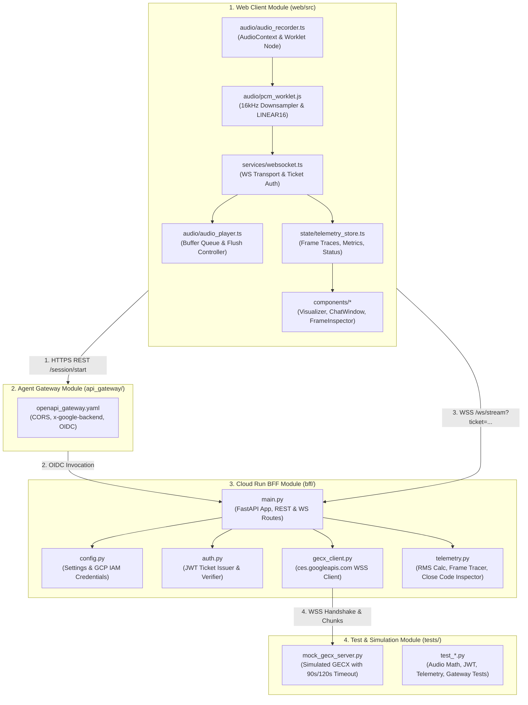
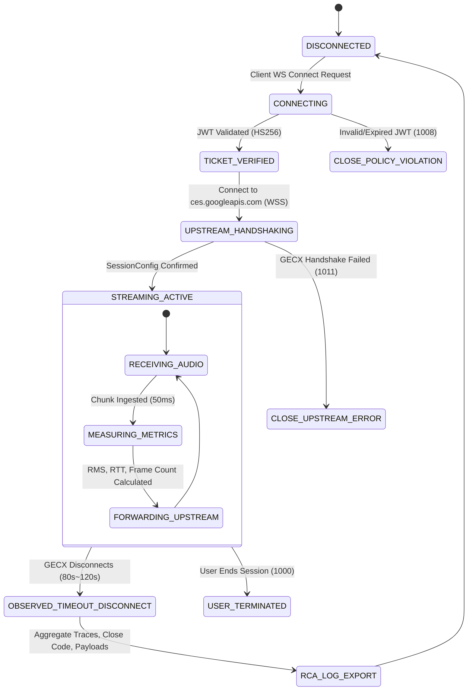
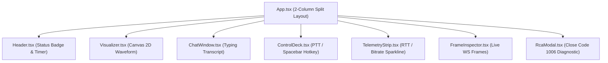

# GECX Real-Time Streaming API (BidiRunSession) Technical Design Document (TDD)

## Document Control

### Document Metadata
| Field | Value |
| :--- | :--- |
| **Document Title** | GECX BidiRunSession Streaming & Diagnostic Telemetry Technical Design Document (TDD) |
| **Author(s)** | Junghyun Ko |
| **Date** | Aug 24, 2026 |
| **Status** | Approved Draft (Ready for Implementation) |
| **Target Audience** | Backend/Frontend Engineers, SRE & Audio Systems Engineers |
| **Parent Architecture** | Solution Design Document ([`sdd.md`](file:///usr/local/google/home/junghyunko/git/2026-CX/02.gecx-streaming-api/sdd.md)) |

---

## 1. System Module Architecture & Class Diagram

### 1.1. Module Dependency & Layered Architecture



---

## 2. Audio Pipeline & Low-Level DSP Mathematics

### 2.1. Audio Specifications Matrix
* **Audio Format**: Raw PCM (Linear Pulse Code Modulation), Uncompressed
* **Encoding**: `LINEAR16` (16-bit Signed Integer, Little-Endian)
* **Sample Rate**: 16,000 Hz (16 kHz)
* **Channel Configuration**: 1 Channel (Mono)
* **Frame Chunk Duration**: **50 ms** (0.050 seconds)
* **Samples per Chunk**: $16,000 \times 0.050 = 800 \text{ samples}$
* **Bytes per Chunk**: $800 \text{ samples} \times 2 \text{ bytes/sample} = 1,600 \text{ bytes}$
* **Transmission Rate**: 20 chunks per second (20 Hz)
* **Bandwidth Requirement**: $1,600 \text{ bytes} \times 20 = 32,000 \text{ bytes/sec} \approx 256 \text{ kbps}$ (Base64 Encoded: $\approx 341 \text{ kbps}$)

### 2.2. Downsampling & Float32 to Int16 Conversion Algorithm

브라우저 마이크의 하드웨어 샘플레이트(기본 44.1kHz 또는 48kHz)를 16kHz로 다운샘플링하고, `Float32Array` ($-1.0 \le x \le 1.0$)를 16비트 정수 `Int16Array` ($-32768 \le x \le 32767$)로 변환합니다.

#### Linear Interpolation Downsampling Math:
$$x_{\text{target}}(t) = x_{\text{source}}(i) + (x_{\text{source}}(i+1) - x_{\text{source}}(i)) \times \text{fraction}$$
where $\text{ratio} = \frac{\text{sourceSampleRate}}{\text{targetSampleRate}}$, $\text{sourceIndex} = t \times \text{ratio}$, $i = \lfloor \text{sourceIndex} \rfloor$, $\text{fraction} = \text{sourceIndex} - i$.

#### AudioWorklet Processor Implementation (`pcm_worklet.js`):
```javascript
class PCM16WorkletProcessor extends AudioWorkletProcessor {
  constructor() {
    super();
    this.bufferSize = 800; // 50ms at 16kHz
    this.outputBuffer = new Int16Array(this.bufferSize);
    this.outputIndex = 0;
  }

  process(inputs, outputs, parameters) {
    const input = inputs[0];
    if (!input || input.length === 0) return true;
    const channelData = input[0]; // Mono input
    const inputSampleRate = sampleRate; // Web Audio context sampleRate (e.g. 48000)
    const targetSampleRate = 16000;
    const ratio = inputSampleRate / targetSampleRate;

    for (let i = 0; i < channelData.length; i += ratio) {
      const idx = Math.floor(i);
      const frac = i - idx;
      const s0 = channelData[idx] || 0;
      const s1 = channelData[idx + 1] || s0;
      const interpolated = s0 + frac * (s1 - s0);

      // Clamp & Scale to Int16
      const clamped = Math.max(-1.0, Math.min(1.0, interpolated));
      const int16Val = clamped < 0 ? clamped * 32768 : clamped * 32767;
      
      this.outputBuffer[this.outputIndex++] = Math.round(int16Val);

      if (this.outputIndex >= this.bufferSize) {
        // Emit 50ms (1600 bytes) buffer to main thread
        this.port.postMessage(this.outputBuffer.buffer, [this.outputBuffer.buffer]);
        this.outputBuffer = new Int16Array(this.bufferSize);
        this.outputIndex = 0;
      }
    }
    return true;
  }
}
registerProcessor('pcm16-worklet-processor', PCM16WorkletProcessor);
```

### 2.3. Audio RMS & Decibel (dB) Telemetry Math

오디오 청크의 음압 레벨을 계산하여 발화(Speech)와 무음(Silence)을 정밀 구분합니다.

$$\text{RMS} = \sqrt{\frac{1}{N} \sum_{i=1}^{N} s_i^2}$$
$$\text{dB}_{\text{FS}} = 20 \times \log_{10}\left(\frac{\text{RMS} + \epsilon}{32767}\right) \quad (\epsilon = 10^{-7})$$

* $\text{dB}_{\text{FS}} \ge -35 \text{ dB}$: 활성 발화 상태 (Active Speech)
* $\text{dB}_{\text{FS}} < -50 \text{ dB}$: 완전 무음/배경 노이즈 상태 (Silence / Noise Floor)

---

## 3. Protocols, API Schemas & Data Structures

### 3.1. Control Plane REST API (`Agent Gateway <-> Cloud Run BFF`)

#### Endpoint 1: Start Streaming Session
* **Route**: `POST /api/v1/session/start`
* **Request Header**: `Authorization: Bearer <GCP_OIDC_ID_TOKEN>` (Injected by Agent Gateway)
* **Request Body**:
```json
{
  "client_id": "web-client-001",
  "requested_deployment": "default",
  "enable_echo_cancellation": true
}
```
* **Response Body (`200 OK`)**:
```json
{
  "session_id": "sess-8a7f4e91-3b2c-4d8e-9f0a-1b2c3d4e5f6a",
  "session_ticket": "eyJhbGciOiJIUzI1NiIsInR5cCI6IkpXVCJ9...",
  "ws_endpoint": "wss://gecx-streaming-bff-7p7fk8nj-uc.a.run.app/ws/stream",
  "ticket_ttl_seconds": 60,
  "app_resource_path": "projects/gemeni-workshop/locations/us/apps/83281339-6a20-482e-8064-4cf96c678d76",
  "audio_config": {
    "encoding": "LINEAR16",
    "sample_rate_hertz": 16000,
    "chunk_duration_ms": 50
  }
}
```

#### Endpoint 2: Health & Liveness Probe
* **Route**: `GET /health`
* **Response Body (`200 OK`)**: `{"status": "UP", "timestamp": 1787561234.56}`

---

### 3.2. Session Ticket JWT Claims Specification
Cloud Run BFF가 발급 및 검증하는 단기 서명 티켓 명세입니다.

```json
{
  "sub": "sess-8a7f4e91-3b2c-4d8e-9f0a-1b2c3d4e5f6a",
  "iss": "gecx-streaming-bff",
  "aud": "gecx-web-client",
  "iat": 1787561100,
  "exp": 1787561160,
  "app_id": "83281339-6a20-482e-8064-4cf96c678d76",
  "location": "us",
  "project_id": "gemeni-workshop"
}
```
* **Signing Algorithm**: HMAC-SHA256 (`HS256`)
* **Secret Key**: `TICKET_SECRET_KEY` (32+ Bytes from Secret Manager / `.env`)
* **Validation Rules**: `iat <= now < exp`, `iss == "gecx-streaming-bff"`, `sub == requested session_id`.

---

### 3.3. Data Plane WebSocket Wire Protocol (`Client <-> Cloud Run BFF`)

* **WebSocket URL**: `wss://<cloud-run-url>/ws/stream?ticket=<JWT_SESSION_TICKET>`
* **Handshake Verification**:
  1. WebSocket 연결 수립 시 쿼리 파라미터 `ticket` 추출 및 JWT 서명/만료 검증.
  2. 검증 실패 시: `1008 Policy Violation` 코드로 즉시 Close.
  3. 검증 성공 시: `101 Switching Protocols` 및 즉시 세션 준비 이벤트 전송:
     `{"event": "session_ready", "session_id": "sess-...", "server_time_ms": 1787561100123}`

#### Ingress Message (Client $\rightarrow$ BFF):
```json
{
  "realtimeInput": {
    "audio": "<Base64_LINEAR16_PCM_Chunk>"
  }
}
```

#### Egress Message (BFF $\rightarrow$ Client):
```json
{
  "recognitionResult": {
    "transcript": "오늘 서울 날씨",
    "isFinal": false,
    "latencyMs": 312.4
  },
  "sessionOutput": {
    "text": "오늘 서울은 맑은 날씨입니다.",
    "audio": "<Base64_Audio_Response>",
    "turnCompleted": true
  },
  "interruptionSignal": {
    "timestampMs": 1787561142100
  },
  "telemetry": {
    "elapsedSec": 84.12,
    "chunksSent": 1682,
    "rttMs": 24.5
  }
}
```

---

## 4. Telemetry & Diagnostic Logging Engine

### 4.1. Microsecond Precision State Machine



### 4.2. Python Pydantic Telemetry Data Models (`bff/telemetry.py`)

```python
from pydantic import BaseModel, Field
from typing import Optional, Dict, Any
from datetime import datetime

class SocketCloseInfo(BaseModel):
    raw_close_code: int = Field(..., description="RFC 6455 WebSocket Close Code")
    close_code_name: str
    close_reason: str
    grpc_status_code: Optional[str] = None
    gcp_error_details: Optional[Dict[str, Any]] = None

class ChunkPayloadMetrics(BaseModel):
    total_audio_chunks_sent: int = 0
    total_bytes_sent: int = 0
    total_chunks_received: int = 0
    total_bytes_received: int = 0
    average_chunk_interval_ms: float = 0.0
    last_chunk_sent_before_ms: float = 0.0
    last_silence_duration_sec: float = 0.0
    mean_audio_rms_db: float = -100.0

class DiagnosticTraceEvent(BaseModel):
    trace_id: str
    session_id: str
    timestamp: str = Field(default_factory=lambda: datetime.utcnow().isoformat() + "Z")
    epoch_ms: int
    elapsed_session_sec: float
    event_type: str  # "FRAME_TX", "FRAME_RX", "BARGE_IN", "SOCKET_DISCONNECTED"
    source_layer: str  # "CLIENT", "BFF_UPSTREAM_GECX"
    payload_metrics: ChunkPayloadMetrics
    socket_close_info: Optional[SocketCloseInfo] = None
```

---

## 5. Offline Mock GECX Server & Verification Suite

### 5.1. Mock GECX Server Specification (`tests/mock_gecx_server.py`)

GCP 실제 API를 호출하지 않고도 로컬 환경에서 스트리밍 파이프라인 및 80~120초 단절 시나리오를 100% 재현하기 위한 모의 서버입니다.

```python
import asyncio
import json
import time
import websockets

class MockGECXServer:
    def __init__(self, host="127.0.0.1", port=8765, disconnect_delay_sec=90.0, close_code=1006):
        self.host = host
        self.port = port
        self.disconnect_delay_sec = disconnect_delay_sec
        self.close_code = close_code

    async def handle_connection(self, websocket, path):
        start_time = time.time()
        # 1. First Handshake message
        init_msg = await websocket.recv()
        config_data = json.loads(init_msg)
        print(f"[Mock GECX] Received SessionConfig: {config_data.get('config', {}).get('session')}")

        try:
            while True:
                elapsed = time.time() - start_time
                if elapsed >= self.disconnect_delay_sec:
                    print(f"[Mock GECX] Injected Disconnect Timeout reached ({elapsed:.2f}s). Closing with Code {self.close_code}.")
                    if self.close_code == 1006:
                        # Abrupt TCP reset
                        websocket.transport.close()
                    else:
                        await websocket.close(code=self.close_code, reason="Simulated GECX Timeout")
                    break

                # Process Realtime Audio Ingest
                try:
                    msg = await asyncio.wait_for(websocket.recv(), timeout=0.1)
                    payload = json.loads(msg)
                    if "realtimeInput" in payload and "audio" in payload["realtimeInput"]:
                        # Mock STT Transcript echo
                        stt_response = {
                            "recognitionResult": {
                                "transcript": "테스트 발화 인식 중...",
                                "isFinal": False
                            }
                        }
                        await websocket.send(json.dumps(stt_response))
                except asyncio.TimeoutError:
                    continue
        except Exception as e:
            print(f"[Mock GECX] Socket finished: {e}")

    async def run(self):
        server = await websockets.serve(self.handle_connection, self.host, self.port)
        print(f"[Mock GECX] Server running on ws://{self.host}:{self.port}")
        await server.wait_closed()
```

---

## 6. Frontend Component & State Engineering (`Leonxlnx/taste-skill`)

### 6.1. Component Hierarchy & State Store



### 6.2. Canvas 2D Oscilloscope Renderer (`Visualizer.tsx`)

GPU 가속 60 FPS Canvas 오실로스코프로 실시간 음성 파형을 그립니다.

```typescript
export function drawOscilloscope(
  canvas: HTMLCanvasElement,
  audioData: Int16Array,
  isListening: boolean,
  isBargeIn: boolean
) {
  const ctx = canvas.getContext('2d');
  if (!ctx) return;
  const width = canvas.width;
  const height = canvas.height;

  ctx.clearRect(0, 0, width, height);

  // Background Grid Line
  ctx.strokeStyle = '#27272a'; // zinc-800
  ctx.lineWidth = 1;
  ctx.beginPath();
  ctx.moveTo(0, height / 2);
  ctx.lineTo(width, height / 2);
  ctx.stroke();

  // Waveform Color logic
  if (isBargeIn) {
    ctx.strokeStyle = '#f59e0b'; // Amber-500
  } else if (isListening) {
    ctx.strokeStyle = '#10b981'; // Emerald-500
  } else {
    ctx.strokeStyle = '#71717a'; // Zinc-500
  }
  ctx.lineWidth = 2;
  ctx.beginPath();

  const sliceWidth = width / audioData.length;
  let x = 0;

  for (let i = 0; i < audioData.length; i++) {
    const v = audioData[i] / 32768.0;
    const y = (v * height) / 2 + height / 2;

    if (i === 0) {
      ctx.moveTo(x, y);
    } else {
      ctx.lineTo(x, y);
    }
    x += sliceWidth;
  }
  ctx.stroke();
}
```

---

## 7. Infrastructure, Deployment & Container Sizing

### 7.1. Cloud Run Resource & Sizing Configuration

* **CPU**: 1 vCPU (Dedicated, non-throttled CPU allocation)
* **Memory**: 1 GiB RAM
* **Concurrency**: 80 concurrent WebSocket connections per instance
* **Request Timeout**: 3600 seconds (1 hour for long-lived WebSockets)
* **Ingress**: `internal-and-cloud-load-balancing` / API Gateway
* **Min Instances**: 0 (Scale to zero for cost optimization)
* **Max Instances**: 10
* **Execution Environment**: Gen 2 (Second Generation Linux Container)

### 7.2. Multi-Stage Dockerfile Specification

```dockerfile
# Stage 1: Build Frontend
FROM node:20-alpine AS frontend-builder
WORKDIR /app/web
COPY web/package*.json ./
RUN npm ci
COPY web/ ./
RUN npm run build

# Stage 2: Python Backend Runtime
FROM python:3.11-slim AS runtime
WORKDIR /app

ENV PYTHONUNBUFFERED=1 \
    PYTHONDONTWRITEBYTECODE=1 \
    PORT=8080

RUN apt-get update && apt-get install -y --no-install-recommends \
    gcc \
    && rm -rf /var/lib/apt/lists/*

COPY requirements.txt .
RUN pip install --no-cache-dir -r requirements.txt

COPY bff/ ./bff/
COPY --from=frontend-builder /app/web/dist ./web/dist

EXPOSE 8080
CMD ["uvicorn", "bff.main:app", "--host", "0.0.0.0", "--port", "8080"]
```

---

## 8. Automated Test Plans & Verification Matrix

| Test Suite | File Path | Test Scenario | Acceptance Criteria |
| :--- | :--- | :--- | :--- |
| **DSP Audio Math** | `tests/test_audio.py` | 48kHz $\rightarrow$ 16kHz 다운샘플링 및 Int16 변환 정확도 | 50ms (800 샘플, 1,600 바이트) 정확 일치, RMS 계산 오차 $< 0.1 \text{dB}$ |
| **Auth & JWT** | `tests/test_auth.py` | 세션 티켓 서명 및 만료(TTL 60s) 검증 | 유효 토큰 통과, 변조/만료 토큰 즉시 1008 거부 |
| **Telemetry Logger** | `tests/test_telemetry.py` | 프레임 카운트, RMS, Close Code 1006 파싱 | 모든 이벤트에 밀리초 타임스탬프 및 구조화 JSON 출력 |
| **Mock GECX E2E** | `tests/test_mock_stream.py` | 90초 인위적 단절 주입 테스트 | 90.0초 시점 단절 감지, Close Code 기록 및 UI RCA 이벤트 수신 |
| **10m Stress Test** | `scripts/stress_test_10m.py` | 10분 연속 Always-On 오디오 전송 부하 | 전송 청크 누락률 $< 0.01\%$, 단절 발생 시 정확한 타임스탬프/RCA 리포트 생성 |
